# Millefleur: iteration archive

The final design is the [Millefleur design system](../../../reference/millefleur/design-system.md).
This folder keeps the way there, so a later designer can see what was tried and why it changed.
[Process and learnings](../../../reference/millefleur/process.md) tells the story; this page
indexes the material.

Each round has its screens as standalone HTML pages (open them in a browser) and JPEG renders.
[canvas/](canvas/) holds the design canvas's own source files (`.dc.html` boards and
`canvas.json`) exactly as they were on claude.ai.

## The written proposal

[first-proposal.md](first-proposal.md): the researched proposal (inspirations, licensing, three
directions with checked palettes, the reviewed binder-and-garden concept), before any screen was
rendered.

## v1: the binder and the garden

| Workshop | Ring | Level-up | Chat |
|---|---|---|---|
| 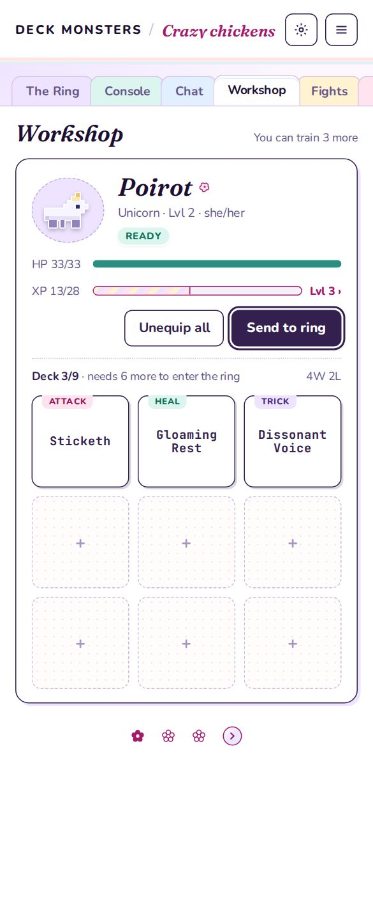 | 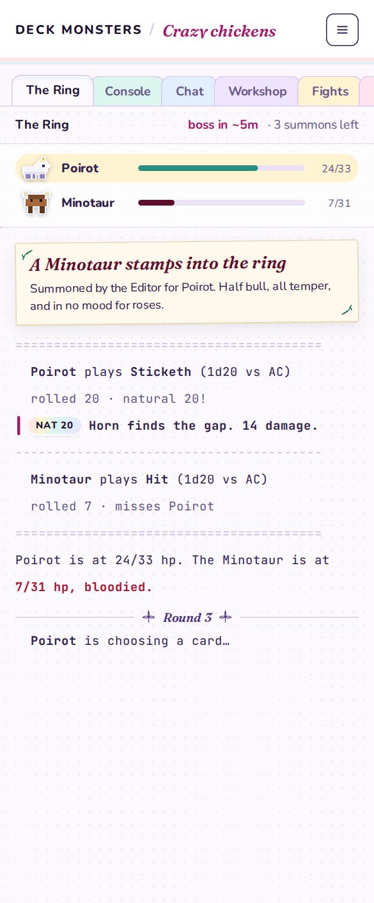 | 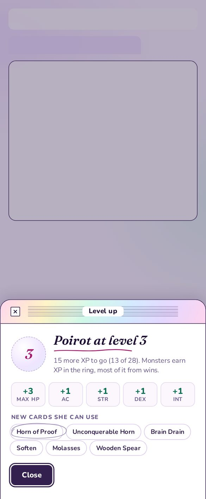 |  |

Feedback: "Too kitchen sink. Needs more consistency, more softness / fading... relying more on
texture and gradient, possibly simpler text, more watercolor."

## The other directions

| A · Holo Folder | B · Gloaming Wash | C · Dream Desktop |
|---|---|---|
| 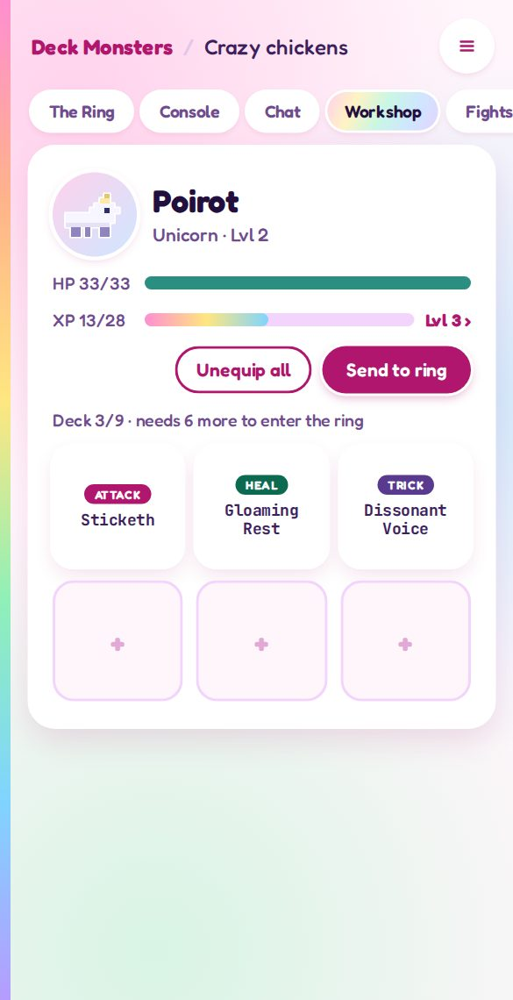 | 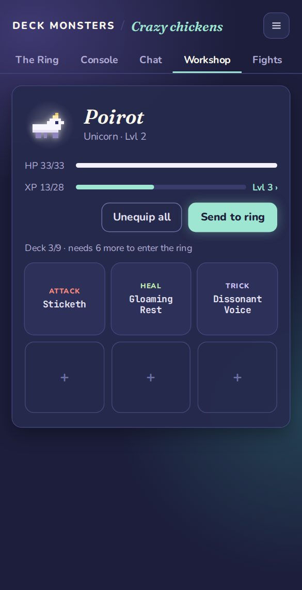 | 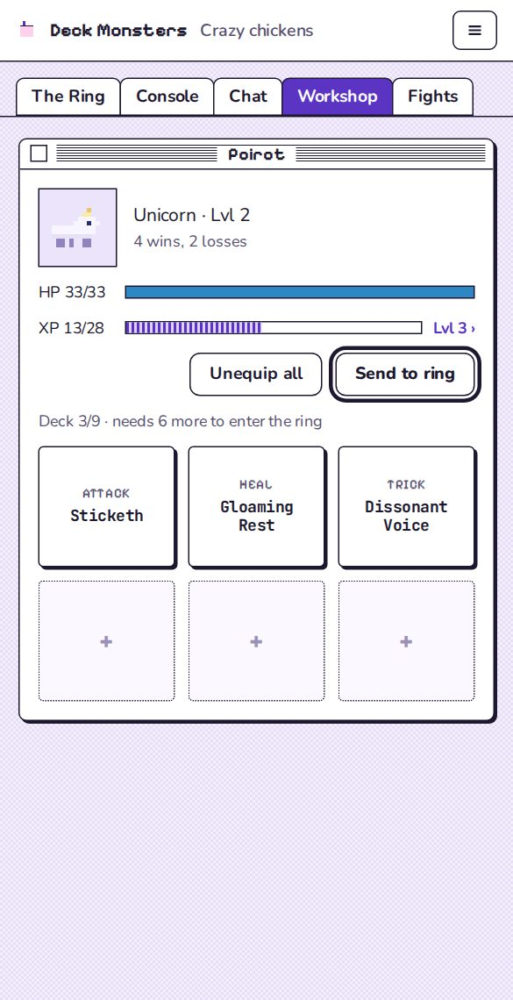 |

Feedback: Holo Folder "fantastic" (its soft rainbow became the holo fade). Gloaming "not my
favorite". Dream Desktop "cool", to be developed as its own theme
([roadmap 47](../../../roadmap/47-dream-desktop-theme.md)), lending Millefleur a few shapes.

## v2: softer, one voice

| Workshop | Ring | Level-up | Chat |
|---|---|---|---|
| 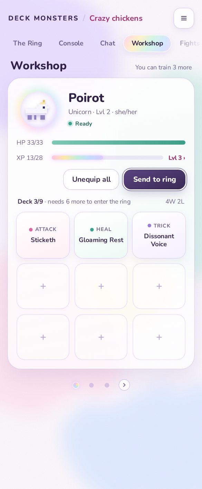 | 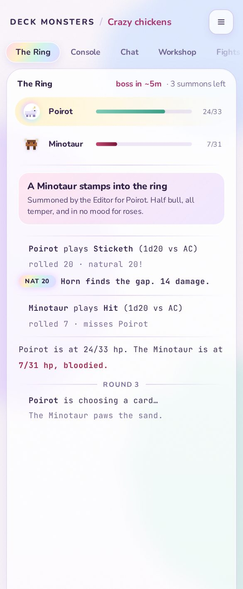 |  |  |

Feedback: "I really like the level up screen." The pill tab was "a little modern"; bring back
folder tabs, gentle, fading at the bottom, colour only on the selected one. More texture. The
ruled chat paper back, but fainter.

## v3: texture

| Workshop | Ring | Level-up | Chat |
|---|---|---|---|
| 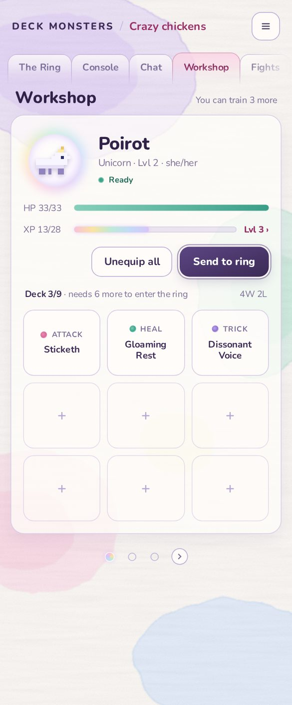 | 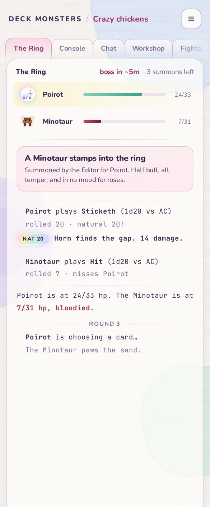 | 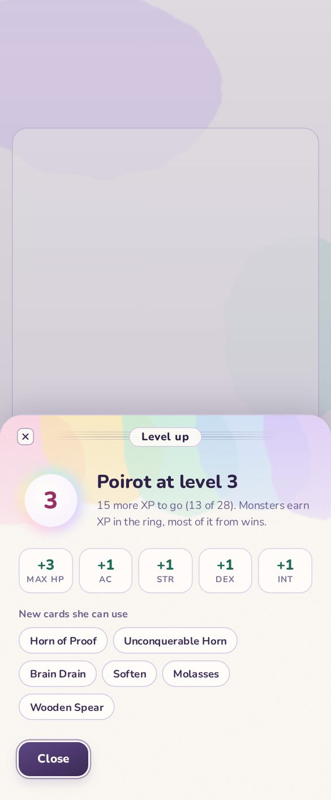 | 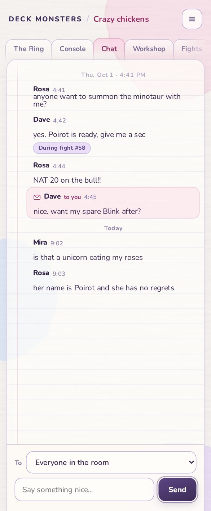 |

Feedback: "Much more polished than any previous iteration." The backgrounds were "blob like":
too round and concentric. The tabs read as "Mac OS 8 early 2000s bubble iMac". "Have you been
rendering and reviewing visually as you go?"

## Studies for v4

Rendered and compared before v4 was built.

| Study | What it decided |
|---|---|
| [Paint 1: techniques](studies/paint-1-techniques.html) ([render](studies/paint-1-techniques.png)) | Granulated wash, dry brush, colour fields, wet edge. Wet edge was the most like watercolour; colour fields had the best pigment variation |
| [Paint 2: compositions](studies/paint-2-compositions.html) ([render](studies/paint-2-compositions.png)) | Combined the two. Overlaps glazed well; edges too jagged, fibre too strong, the brush stroke digital |
| [Paint 3: refined](studies/paint-3-refined.html) ([render](studies/paint-3-refined.png)) | Two-scale warp for softer edges, fainter fibre. Q (sky and lilac glazing) chosen |
| [Tabs 1: shapes](studies/tabs-1-shapes.html) ([render](studies/tabs-1-shapes.png)) | Classic folder, manila shoulders, flat dividers, trapezoid. The sloped shoulder read as a folder |
| [Tabs 2: in context](studies/tabs-2-folder.html) ([render](studies/tabs-2-folder.png)) | Selected tab joined to the page; a rose wash beat a rose bar; translucent tabs crossed lines |

## v4: final

The final screens are [the design system's samples](../../../reference/millefleur/samples/), as
approved ("Perfection") after the ruled-line fix and the contrast fix.
