# Live check of room chat

Checked on 2026-10-01 against the local web app, on branch `cursor/chat-check-41a`, from
`claude/unicorn-monster-cards-cigpmw` at `ad8d724a`. The checklist is
[41a](../roadmap/41a-cursor-chat-check.md). Chat's tables are only on this branch's migration,
so the check used the local Supabase stack. The remote database was not migrated.

Three signed-in players trained monsters in one local room, `Scratch chat-check 2026-10-01`.
Their character names were Anthony, Bourdain, and Anthony Bourdain. The room was deleted from
the local database at the end.

Phone shots are 390×844. The desktop shot is 1440×900. Native `title` tooltips do not paint
into screenshots; where a tooltip is the judgement, the `title` attribute was read from the
element.

## A. The Chat tab

| Item | Result | What was on screen |
|---|---|---|
| 1. Six tabs, tooltip, subtitle | Pass | At 390 the tab bar's scroll width equals its width (390). Labels: The Ring, Console, Chat, Workshop, Fights, Leaders. The Chat tab's `title` and the panel subtitle are both `Talk with everyone in this room, or send a message to one player.` |
| 2. Empty panel | Pass | `No messages yet. Say hello, or cheer on a fight.` |
| 3. `hello` to Everyone | Pass | Sender sees `You: hello`. The other player sees `Anthony: hello` without a reload. Both have a divider `Today, 2:50 PM` above the first message. |
| 4. Unread | Pass | With Chat not open, the tab badge is `1` and its accessible name is `Chat, 1 unread`. The badge box sits above the word Chat and does not intersect the label. Opening Chat shows `New since you were last here` above `Anthony: cheer`. The list was already at the bottom, and the badge was gone. |
| 5. A DM from the To picker | Pass | Choosing Bourdain highlights the picker and the placeholder is `Message Bourdain…`. The sender sees `✉️ You to Bourdain: for your eyes`. Bourdain sees `✉️ Anthony to you: for your eyes`. The third player, on Chat, does not get that line. |
| 6. During a fight | Pass | A message sent after `The fight has begun!` sits under `During fight #1`. An earlier `mid fight`, sent before the fight started, has no fight divider. |
| 7. Six messages quickly | Pass | Six sends finished in about 210ms. The sixth is refused with `Easy there. Wait a few seconds before the next message.` and `rapid 6` stays in the box. |
| 8. Desktop picker and the menu | Pass | At 1440, with The Ring and Console in the panes, the picker's options include `Chat · 14 unread`. The header has a Chat link whose `title` is the same sentence as the tab. The ☰ button is not on screen at 1440 (it is hidden above 600px). At 390, ☰ opens a menu that contains Chat, with that same `title`. |

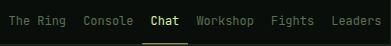

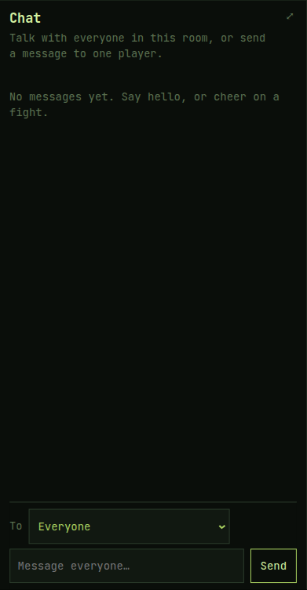

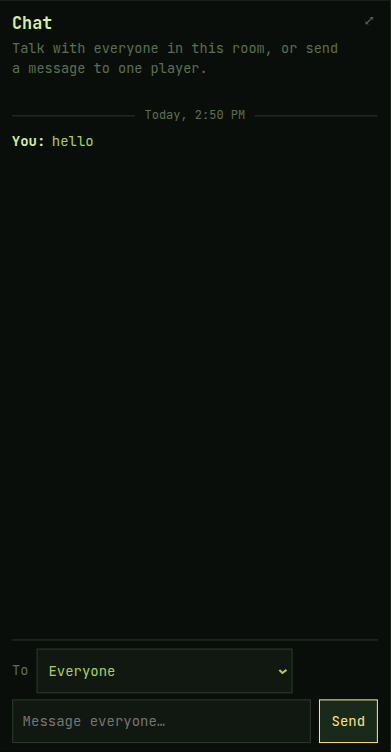

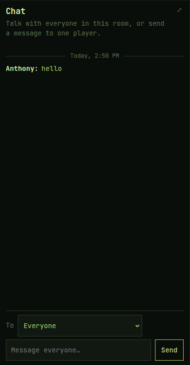

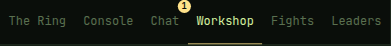

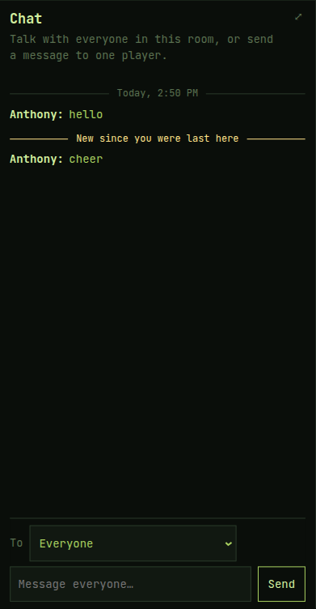

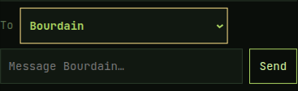

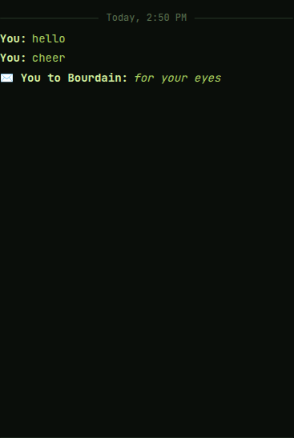

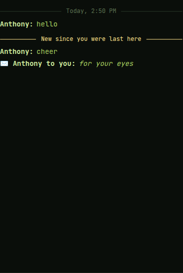

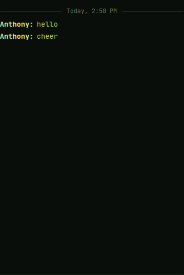

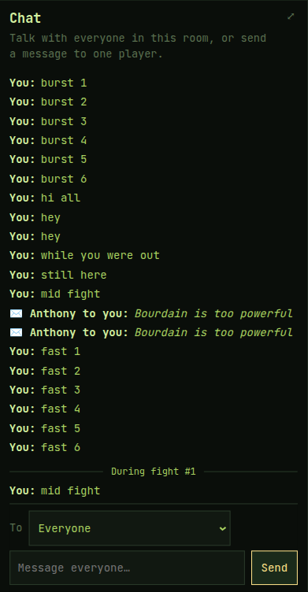

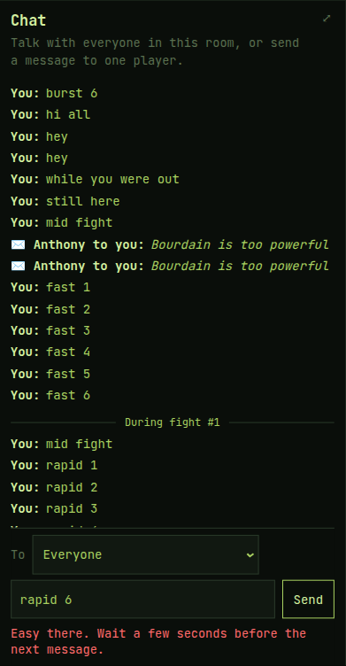

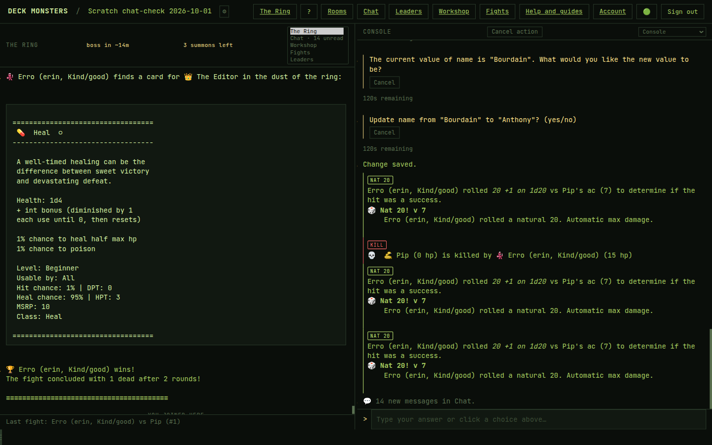

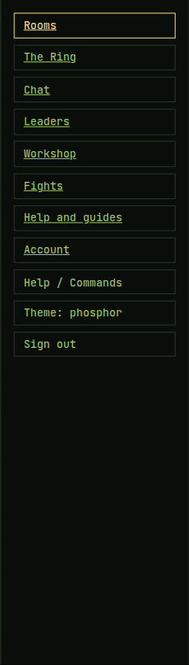

## B. The Console

| Item | Result | What was on screen |
|---|---|---|
| 9. `msg`, `m`, `message` | Pass | The sender's Console shows `💬 You: hi all` and two `💬 You: hey` lines. The other Console shows `💬 Anthony: hi all` and `💬 Anthony: hey`. |
| 10. Empty `msg` | Pass | `Say something after msg, like: msg nice hit, Fang!` |
| 11. Unread on opening the Console | Pass | Returning to the room opens the Console on `💬 4 new messages in Chat.` A later desktop open showed `14 new messages in Chat.` |
| 12. Chat while `equip` is open | Pass | `msg still here` appears as `💬 You: still here` and the card question stays open. `m Jones` is not posted to chat. The question answers `"m Jones" is a command, not a card. Cancel this question first, then run it.` and asks again. |

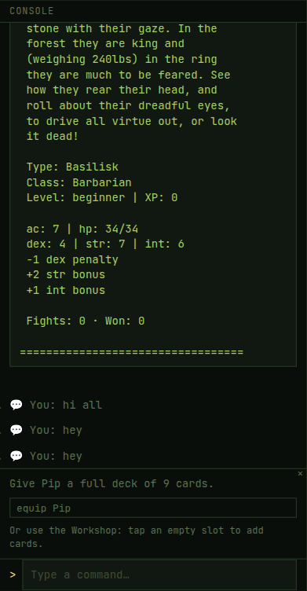

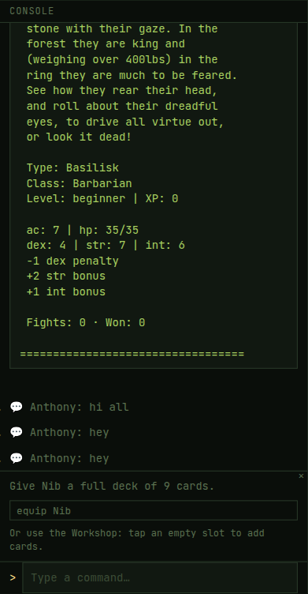

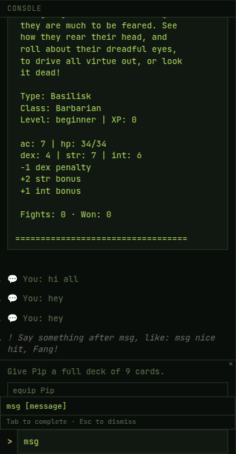

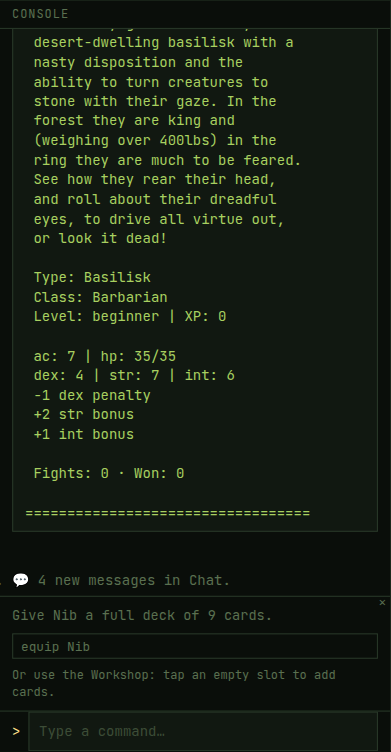

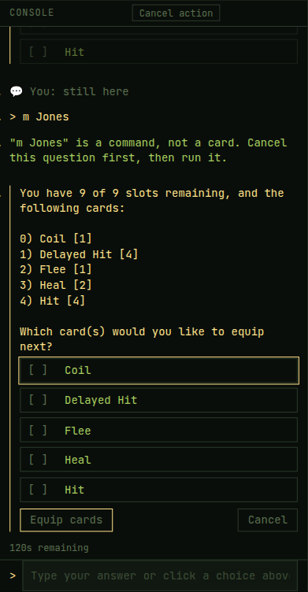

## C. Who a DM goes to

| Item | Result | What was on screen |
|---|---|---|
| 13. `dm Anthony Bourdain is too powerful`, not sent | Pass | The line above the input is `To: Anthony Bourdain. Anthony is in this room too. Pick a name from the list to be sure.` **Anthony Bourdain** is the highlighted name. |
| 14. Suggestion order, then pick Anthony | Pass | After a DM to Anthony Bourdain and one received from Anthony, `dm ` lists Anthony Bourdain, then Anthony. Picking Anthony and sending `Bourdain is too powerful` delivers that line to Anthony. Anthony Bourdain does not get it. The list does not include yourself (`members` omits the caller), so with three players the ring tier had nobody left once those two were already listed. |
| 15. Quoted, bare `dm`, Zed, yourself | Pass | `dm "Anthony" only the short name` arrives for Anthony as `Bourdain to you: only the short name` and not for Anthony Bourdain. `dm ` previews `Type dm, a player's name, and your message, like: dm Ada good luck.` Sending `dm` prints that same sentence. `dm Zed hi` previews `No player here by that name yet.` and on send prints `Nobody in this room goes by that name. Use the name as it shows in Chat, like: dm Ada good luck.` `dm Bourdain hi`, typed by Bourdain, previews `That's you. Pick someone else.` |
| 16. Two players, one name | Pass | After the second player is renamed to Anthony, `dm Anthony hi` previews `Two players here go by Anthony. Pick one from the list.` Sending is refused with that sentence. The suggestion list is `Anthony`, `Anthony`. Picking the first and sending `from the list` shows `✉️ You to Anthony: from the list`. |

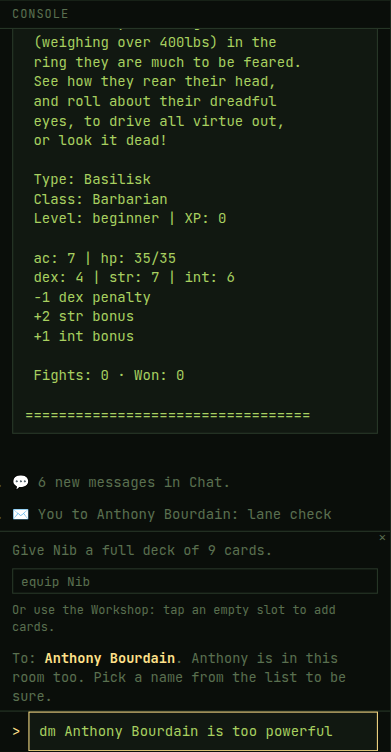

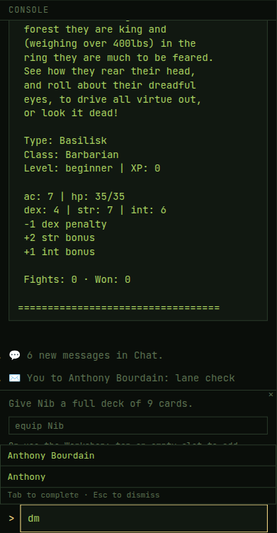

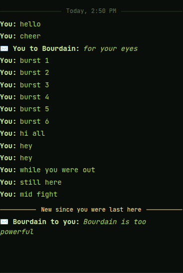

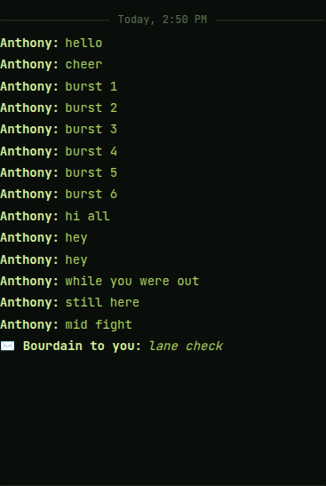

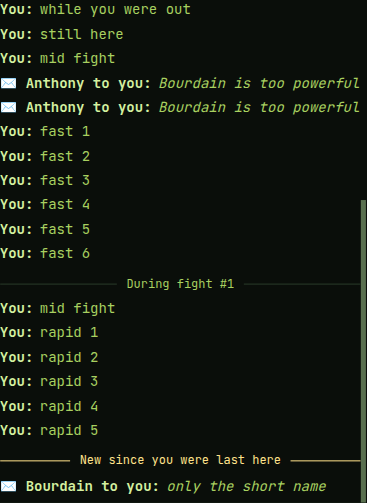

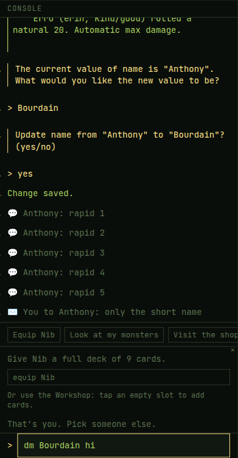

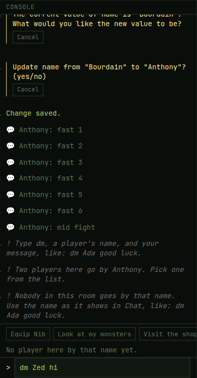

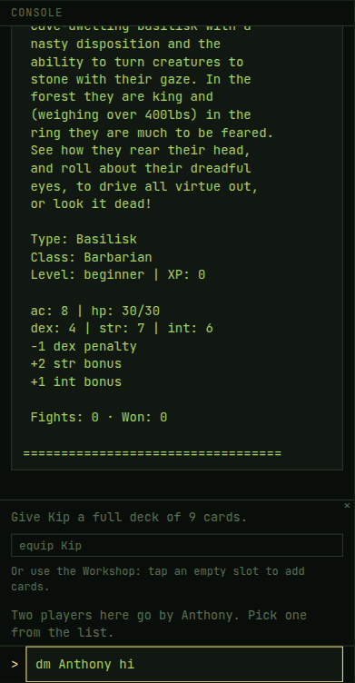

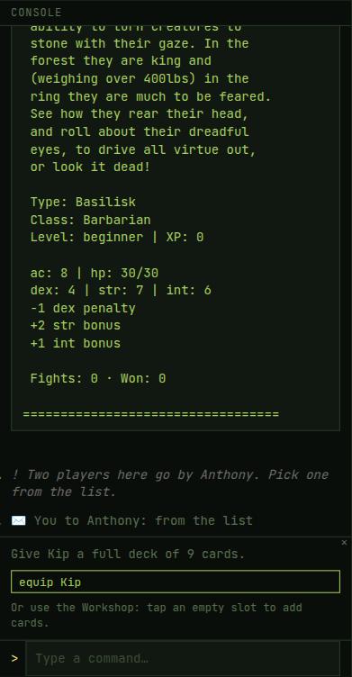

## D. Help

| Item | Result | What was on screen |
|---|---|---|
| 17. Handbook and `help msg` / `help dm` | Pass | Help and guides → How to play has **Talking to Other Players**, listing `msg [message]` and `dm [player] [message]`. `help msg` shows `Try: msg nice hit, Fang!` `help dm` shows `Try: dm Ada good luck tonight`. |

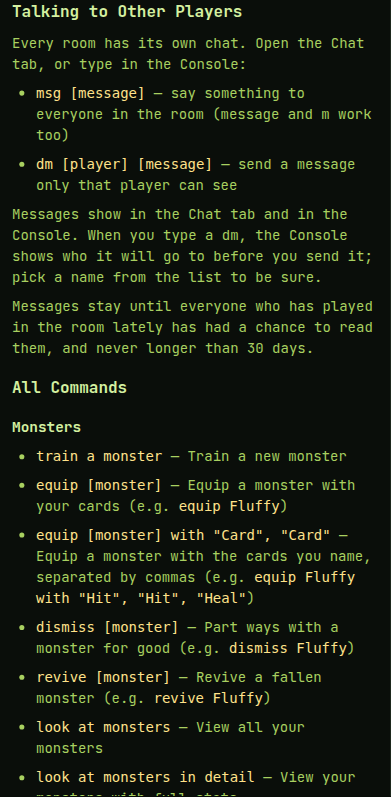

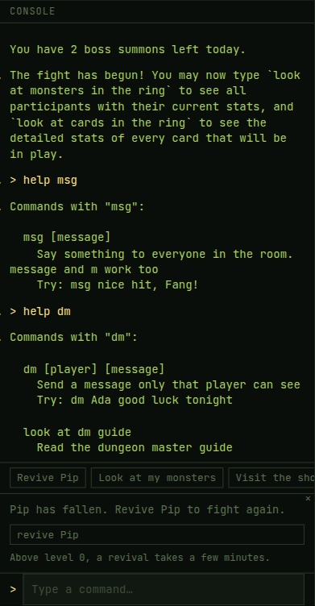

## Fixed on the way

None. No code fix.

## Strings for Claude

This check added no `// DRAFT(41)` line.

One was already on the branch, in `apps/web/src/components/ChatPanel.tsx`: the chat box's
accessible name is `Your message` (`INPUT_LABEL`). It is not a string in the checklist.

## Not reached

None. All 17 items were judged.

Item 14's ring tier was not a separate row. The suggestion list leaves you out, and the other
two players were already the last person a DM was sent to and the last person who sent one.
Putting a monster in the ring could not add a third name.

## Anything else confusing

The ☰ control is the phone menu. At 1440 it is not displayed, and Chat is a link in the header
instead. The menu shot above is from 390.

`help dm` also lists `look at dm guide` (`Read the dungeon master guide`), because that
command contains the letters `dm`. The direct-message command and its example are there too.
See the help shot.

While an `equip` question is open, `m Jones` is not sent to the room, and it is not treated as
a card named Jones. The question says `"m Jones" is a command, not a card. Cancel this question first, then run it.` and stays open. `msg still here` does go to chat. See the equip shot.

The first-run guide (`Give Nib a full deck of 9 cards.` and an `equip Nib` chip) sits in the
Console between chat lines and the input. It showed up on top of several of the shots above.

The boss summoned for the fight divider is named `Error (erin, Kind/good)` in the ring and in
the Console (`Error (erin, Kind/good) wins!`). The desktop shot shows that name. Chat's
`During fight #1` divider still appeared.

At 390 the room name in the header wraps to three lines (`Scratch chat-` / `check 2026-10-` /
`01`). At 1440 it fits on one line, as in the desktop shot.
