# Live check of roadmap 39 batch 2

Checked on 2026-09-30 against the running web app, on branch `cursor/help-check-39-batch2`,
from `claude/unicorn-monster-cards-cigpmw` at `39dbeadb`. Viewports were 390×844 and 1440×900.
Training, the fight, and the card moves used a throwaway room, `Scratch help-check-batch2 2026-09-30`,
which was deleted afterwards. Test Room A and Test Room B were not opened. Game Night was not opened.

The suggested character name embeds an account id fragment, so frames that show it are not in
this folder. Quoted lines below replace that name with `<suggested>`.

## B1 — Console on a phone

| Clause | Result | What was on screen |
|---|---|---|
| Chips and the getting-started guide hide while a question is open, and come back when it closes | Pass | On the name question, the type question, the monster-name question, and the equip question: suggestion chips absent, getting-started guide absent. After Cancel, chips and the guide were both present again. Before the first question the guide was on screen (`Welcome, Beastmaster. Train your first monster to begin your journey.`) and the chips were not there yet. |
| The question is fully visible | Fail | A short question was fully on screen. A long choice list is covered at the bottom by `A command is waiting for your answer. Command suggestions are paused.` The banner is for a question that has scrolled off; here the question was still on screen and the lower choices were not. |
| Monster name question | Pass | `What would you like to name them? Type a name, or take one of these: muzqa, ye'apendox.` |
| A command typed into the equip question | Pass | `"send Pip to the ring" is a command, not a card. Cancel this question first, then run it.` The equip question stayed open (`You have 8 of 9 slots remaining…`). |
| Equip example has no JSON | Pass | Help → Commands: `eg: equip Fluffy with "Hit", "Hit", "Heal"`. No JSON array. |

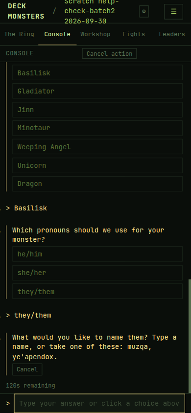

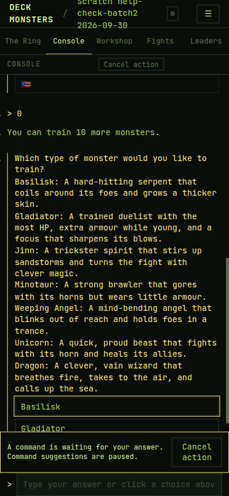

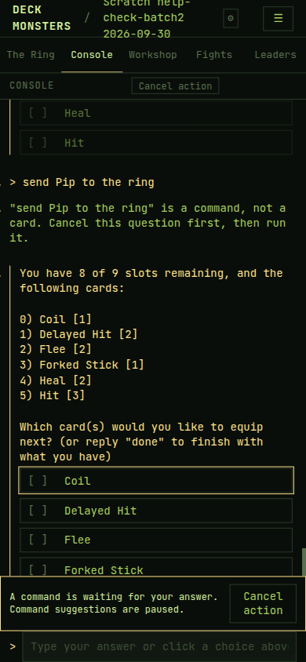

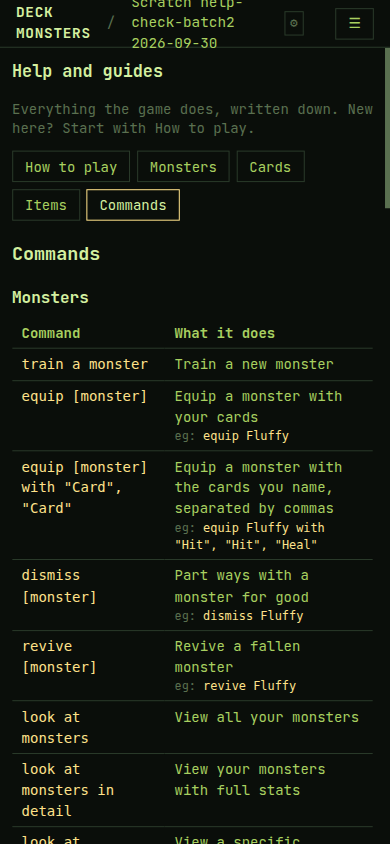

## B2 — A fight that is on

| Clause | Result | What was on screen |
|---|---|---|
| Fights while a fight is on | Pass | `A fight is on in the ring. It shows here when it ends.` Phone and desktop. The earlier fight stayed listed under that line. |
| Leaders while empty and a fight is on | Pass | `No ranked fights yet. A fight is on in the ring; rankings update when it ends.` |
| The fight appears in Fights on its own | Pass | The Fights pane was left open. It kept the in-progress line, and the "16 min ago" stamp advanced by itself. When the fight ended, that line was replaced, without a reload, by `#2 Pip vs Herinth Protector Of Creatures` and `Draw — Pip and Herinth Protector Of Creatures` (4s ago on the frame). |
| Workshop, monster in a fight | Pass | `Pip is in a fight. Cards unlock when it ends.` |

The finished row from the first fight read `Pip won vs Habriel in 2 rounds · Card: HealCard`.
`HealCard` is the class name, not the card's name.

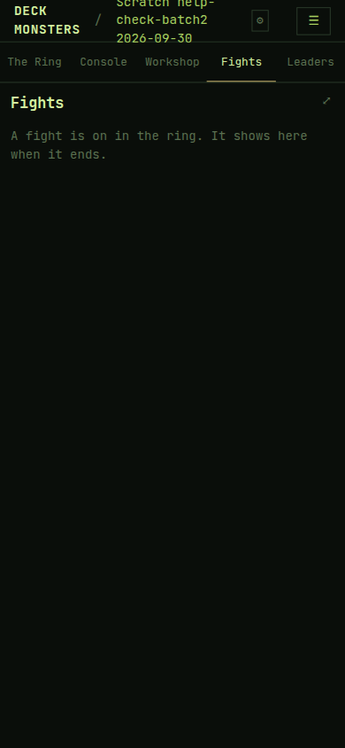

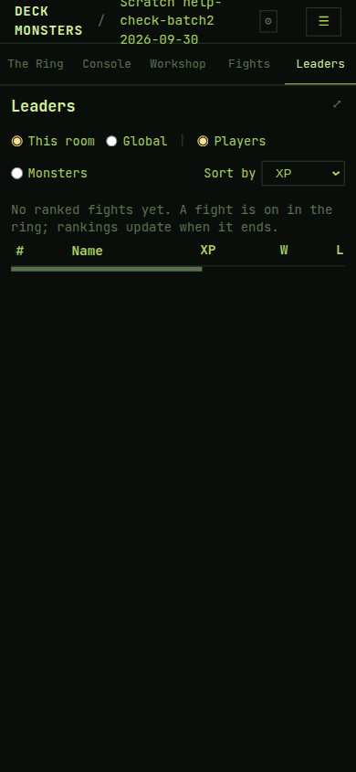

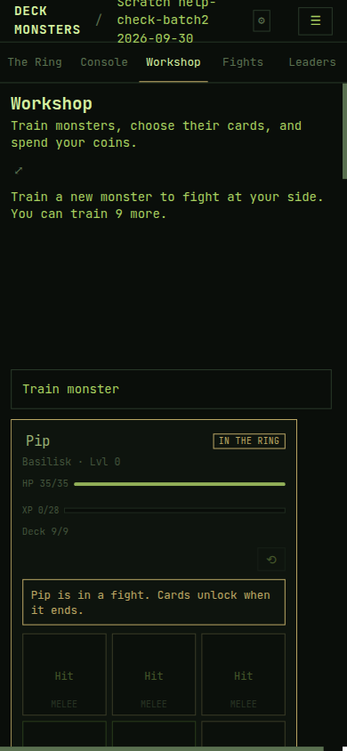

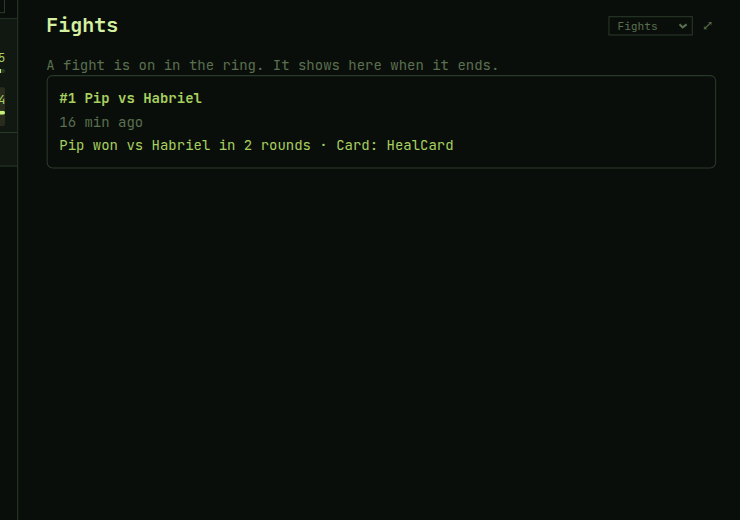

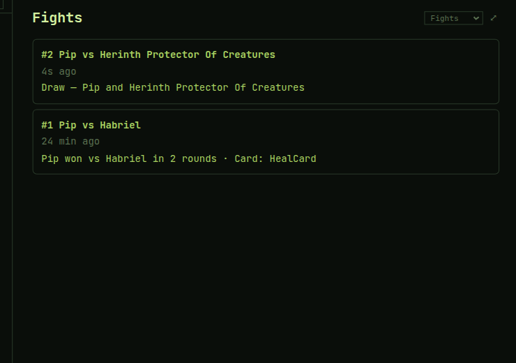

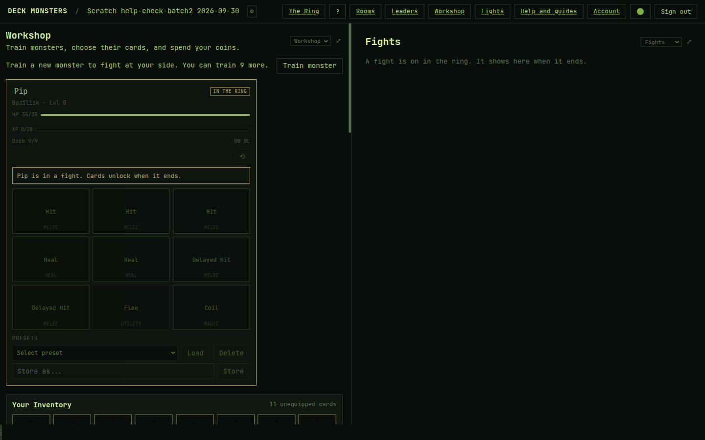

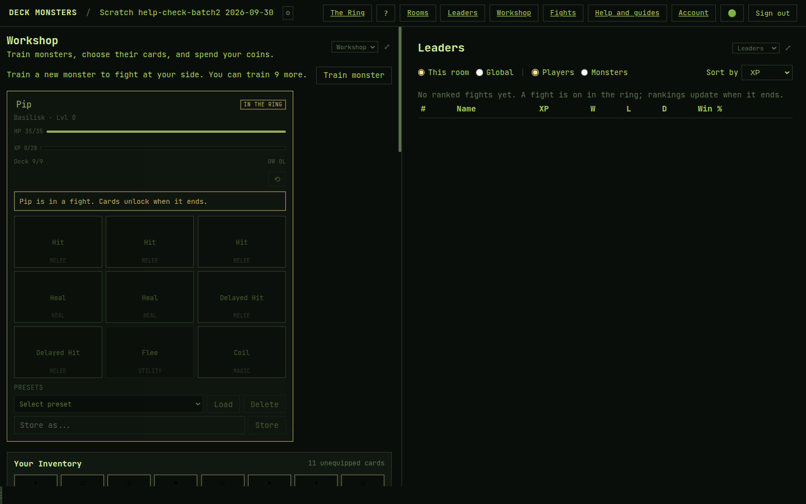

## B3 — Ring header and the boss

| Clause | Result | What was on screen |
|---|---|---|
| Countdown and summons on a clear ring | Pass | Desktop, before any summon: `boss in ~18m` and `3 summons left`. Phone, before the first summon: `boss in ~11m` and `3 summons left`. During the countdown: `fight in 58s` and `2 summons left`, then `1 summon left` before the second fight. |
| Both hidden during a fight | Pass | The ring header was `THE RING` alone. After the second fight they came back: `boss in ~13m` and `1 summon left`. |
| A long boss name wraps | Pass | `Herinth Protector Of Creatures` at 390px: two lines, `white-space: normal`, `overflow-wrap: anywhere`, horizontal overflow 0. The whole name was visible. Habriel, the first boss, fit on one line. |
| A boss's turn names the boss | Pass | `It's Herinth Protector Of Creatures's turn.` |

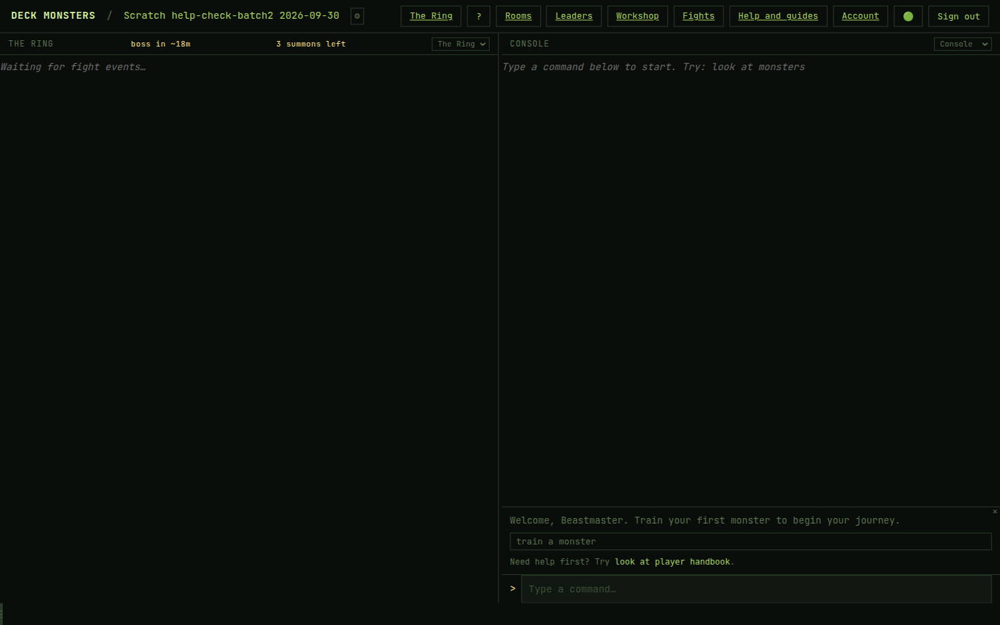

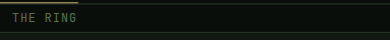

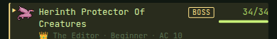

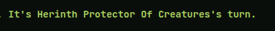

## B4 — One name per place

| Clause | Result | What was on screen |
|---|---|---|
| Tabs | Pass | `The Ring`, `Console`, `Workshop`, `Fights`, `Leaders`. |
| Page and pane headings | Pass | `THE RING`, `CONSOLE`, and the page headings `Workshop`, `Fights`, `Leaders`. |
| ☰ menu | Pass | `Rooms`, `The Ring`, `Leaders`, `Workshop`, `Fights`, `Help and guides`, `Account`, `Help / Commands`, `Theme: phosphor`, `Sign out`. Console is not a menu item. |
| Desktop links | Pass | `The Ring`, `Rooms`, `Leaders`, `Workshop`, `Fights`, `Help and guides`, `Account`, Sign out, and the theme circle. Console is the pane heading, not a header link. |
| Old names | Pass | No Terminal, Fight log, Leaderboard, or Deck Workshop. |
| Five tabs at 390px, every theme | Pass | Phosphor, amber, ember, and street-fighter. Each tab 78px wide. Tab-bar scroll 0, page overflow 0, no tab clipped, none off the bar. |

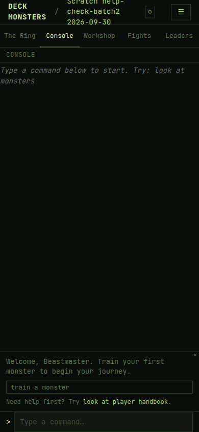

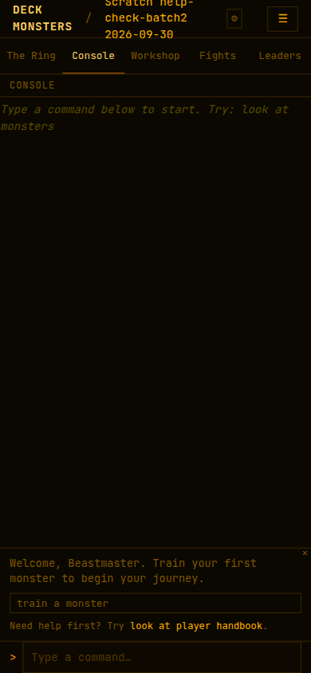

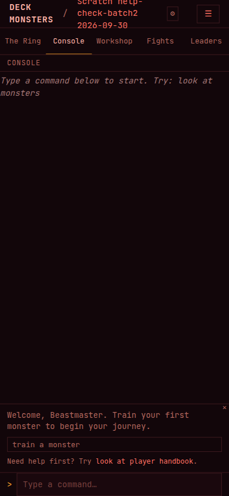

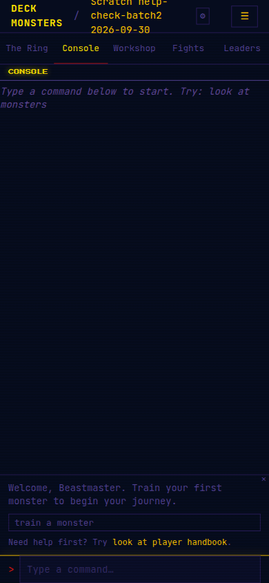

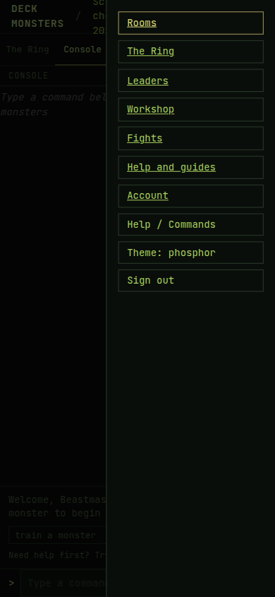

## B5 — Training and card moves

| Clause | Result | What was on screen |
|---|---|---|
| New player's name, and `ok` | Pass | `What should we call you? Type a name, or type ok to be <suggested>.` Typing `ok` was accepted (HTTP 200) and the next question was `Which pronouns should we use for you?` |
| One line per monster type | Pass | Console question `Which type of monster would you like to train?` then one `Label: summary` line for Basilisk, Gladiator, Jinn, Minotaur, Weeping Angel, Unicorn, and Dragon. |
| Workshop training form | Pass | With Basilisk selected, the line beside the Type control was `A hard-hitting serpent that coils around its foes and grows a thicker skin.` The other six types showed the same lines as the Console. The form was cancelled and did not train a second monster. |
| After training | Pass | On the Console, before the monster was added and while 10 places were free: `You can train 10 more monsters.` After Pip existed, the Workshop row was `You can train 9 more.` That row does not repeat the word "monsters". |
| A refused card move | Pass | Workshop, deck full: `Fire Breath can't go on Pip: every card slot is taken.` After one slot was freed: `Fire Breath can't go on Pip: that kind of monster can't use it.` |
| A successful equip | Pass | `Equipped Hit on Pip. Pip holds 9 of 9 cards.` |

The Console's step-by-step equip does not use those two sentences. One `Hit` reopened the question (`You have 8 of 9 slots remaining…`). A later command typed into that question was refused as a command. Filling the deck in one command then said `You've filled your slots with the following cards:` and `Pip is good to go!`

Taking one card off in the Workshop said `Unequipped 1 cards from Pip.`

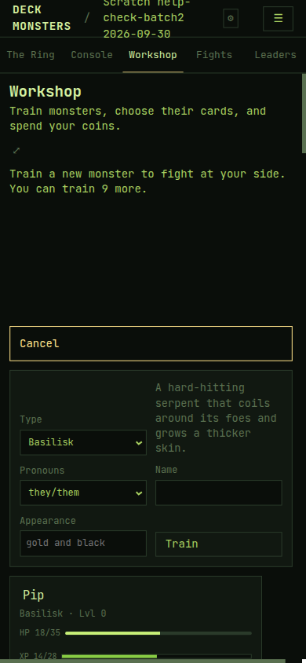

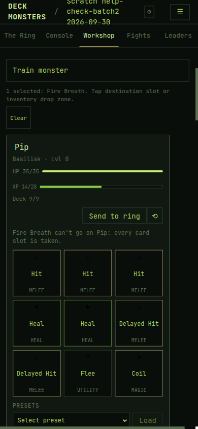

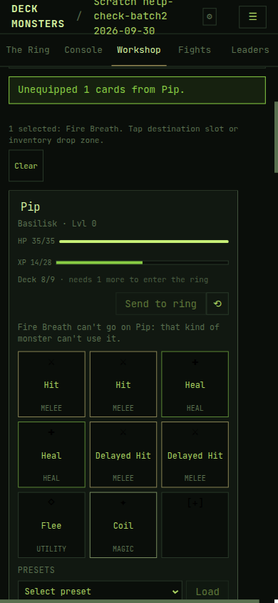

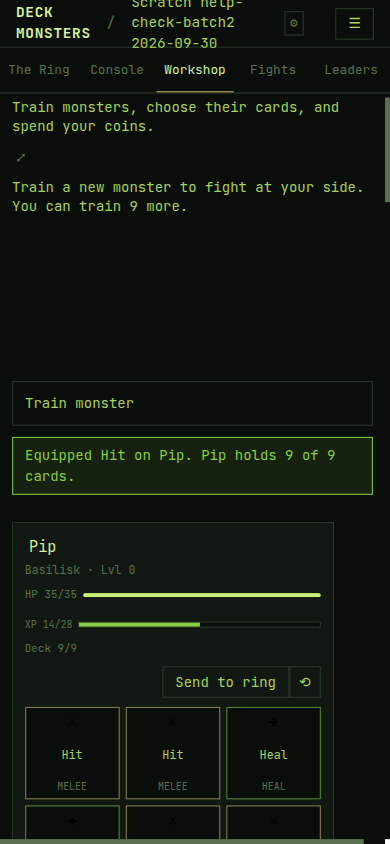

## B6 — Reading a Fight, and Level 1

| Clause | Result | What was on screen |
|---|---|---|
| Reading a Fight | Pass | Help and guides → How to play includes the heading `Reading a Fight`. The section starts `The ring narrates every roll.` |
| Level 1 at 28 XP | Pass | `Level 1: 28+ XP`. The same list has `Beginner: 0–27 XP` and `Level 2: 65+ XP`. Help page overflow was 0 at 390px. |

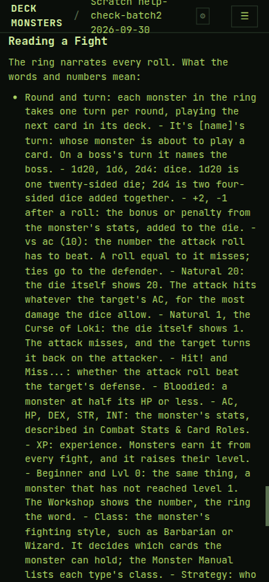

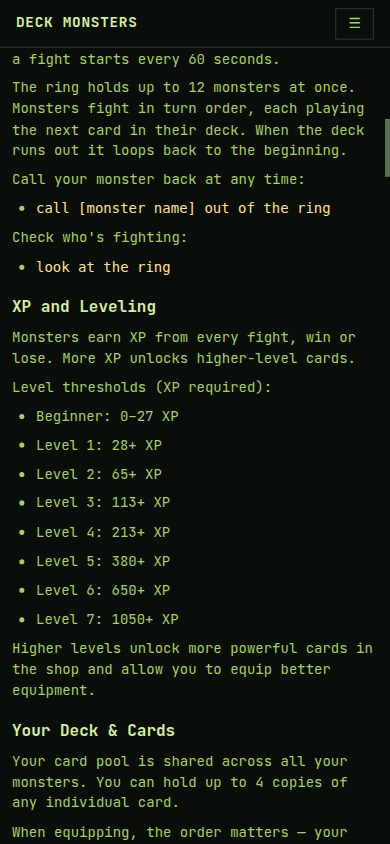

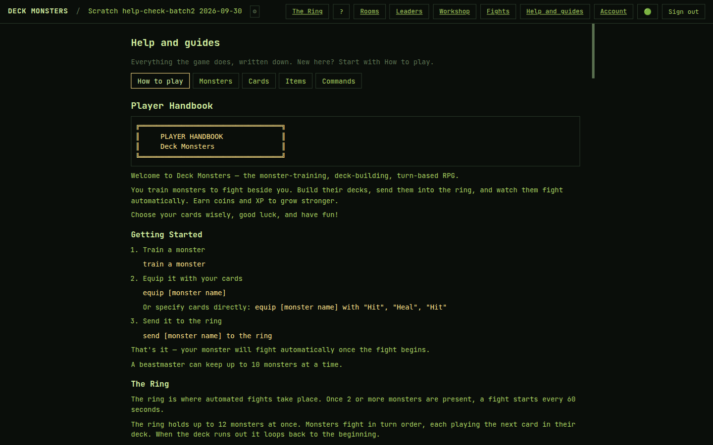

## Rooms after the check

Test Room A and Test Room B were not changed. Game Night was not opened. The scratch room
was deleted. Reusable rooms are listed in [local testing](../operations/local-testing.md#reusable-rooms-remote-test-account).

## Fixed on the way

None. The banner over a long question is prompt-visibility behaviour, and the other gaps
are wording. Neither is a small change that leaves every player-facing sentence as it is.

## Strings for Claude

- The paused-command banner covers the bottom of a long question (`A command is waiting for your answer. Command suggestions are paused.`), including the type list and the equip card list. Chips and the guide really are hidden; the banner is what is wrong.
- Console equip still announces `You've filled your slots with the following cards:` and `Pip is good to go!`, not `Equipped <Card> on <Monster>. <Monster> holds K of 9 cards.`
- Unequipping one card says `Unequipped 1 cards from Pip.`
- A finished fight row says `Card: HealCard`.
- A boss whose name already ends in s is named with another `'s`: `It's Herinth Protector Of Creatures's turn.` That matches `It's <boss name>'s turn.` and reads oddly.
- The place count on the Console is announced before the new monster is added (`You can train 10 more monsters.` with 10 places free). The Workshop row after that was `You can train 9 more.`

## Not checked

- `Reviving…` and `Fallen · back at <time> (in N min)`. Pip finished at level 0 (14/28 XP). A timed revival needs a monster above level 0. Test Room A's monsters are also level 0, and that room was not used.
- A balance of `1 coin`. The scratch room's shop showed `14 coins` and `68 coins` on priced buttons, not a wallet of 1.
- A full roster: `(1 monster)` / `(N monsters)` and a disabled Train monster button. One monster was trained, so the row was `You can train 9 more.`
