# Live check of roadmap 39 batch 3

Checked on 2026-10-01 against the running web app, on branch `cursor/help-check-39c`, from
`claude/unicorn-monster-cards-cigpmw` at `83f4cc48`. Viewports were 390×844 and 1440×900.
The checklist is [39c](../roadmap/39c-cursor-batch3-check.md).

Command help, button titles, and the first boss note used Test Room A. The guided start used
two throwaway rooms, `Scratch help-check-39c 2026-10-01` and `Scratch help-check-39c-b 2026-10-01`.
Both were deleted at the end. Test Room B was not opened. Game Night was listed in the lobby
and was not entered.

`mechanicsExplained:*` was cleared three times, all in Test Room A: once before the first boss
(no key was stored yet), once after that boss while the fight was still going, and once more
after the fight so the landed row could be checked again. `ftuxComplete*` and `ftuxStarted*`
were not cleared. The guide appeared in each new room because that browser profile had no
stored flags yet.

Native `title` tooltips do not paint into these screenshots. Where a tooltip is the judgement,
the `title` attribute was read from the element, and the shot shows the control.

## A. Command help

| Item | Result | What was on screen |
|---|---|---|
| 1. `help` | Pass | The list ends with `Type help and a word to see those commands with an example, like help preset.` and then `-- One Thing Worth Knowing --`. |
| 2. `help preset` | Pass | `Commands with "preset":` and four commands (`save`, `load`, `look at`, `delete`), each with a description and a `Try:` line. |
| 3. `help zzz` | Pass | `No command has "zzz" in it. Type help to see them all.` |
| 4. `look at` | Pass | `look at Fang` shows the basilisk. `look at Hit` shows the card (`A basic attack, the staple of all good monsters.`). `look at Potion of Healing` shows the item (`Instantly heal 8 hp.`). `look at` alone replies `! Command not recognized`. |

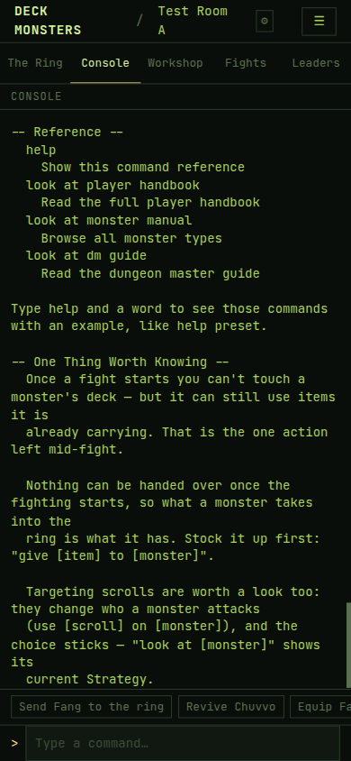

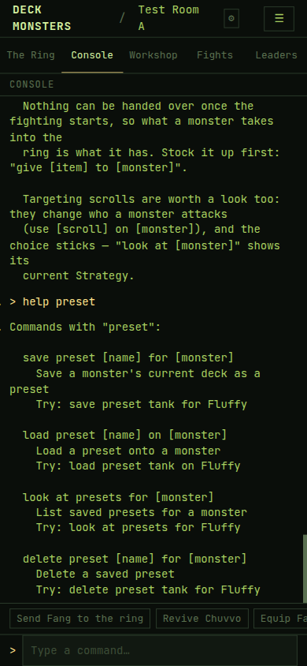

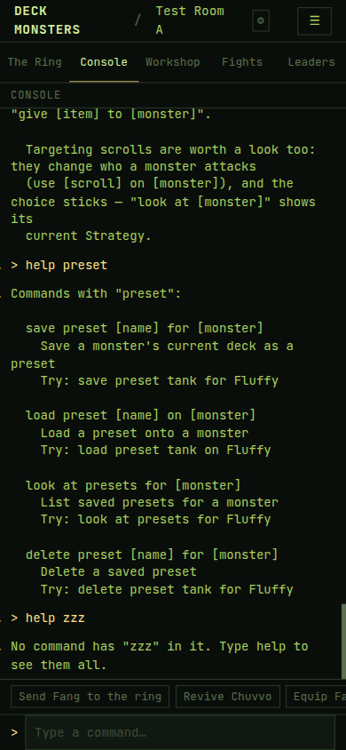

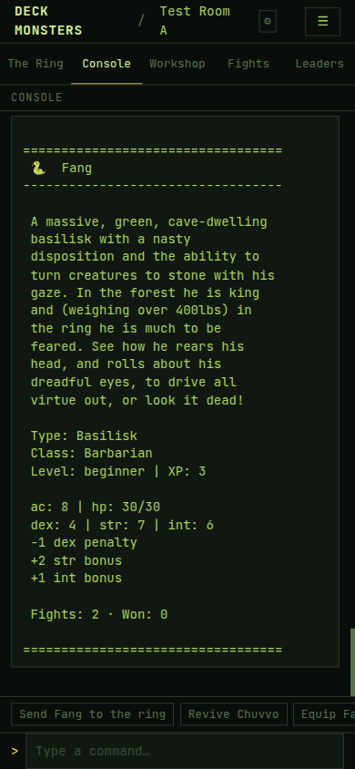

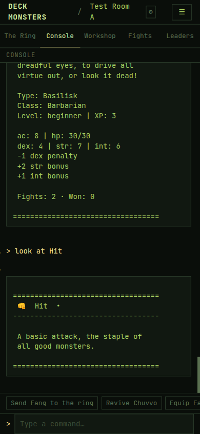

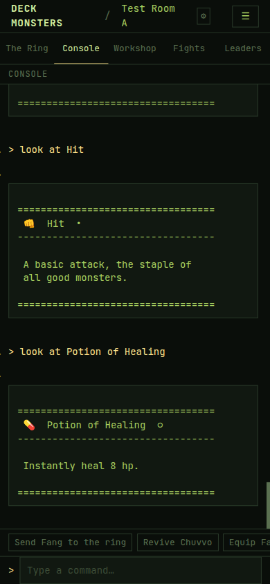

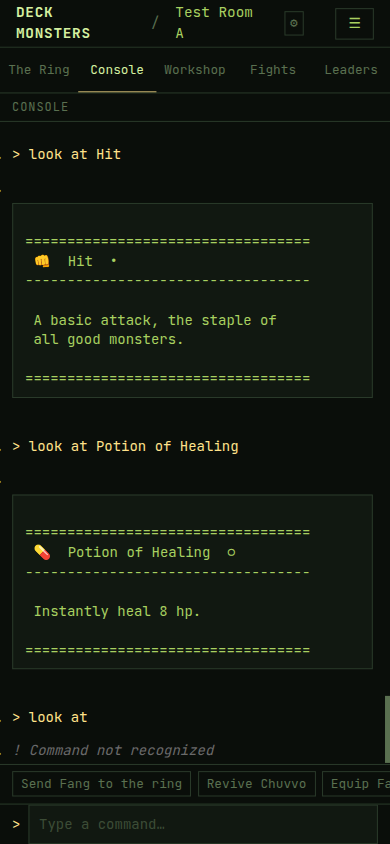

## B. Buttons and places

| Item | Result | What was on screen |
|---|---|---|
| 5. Button titles | Pass | Each required `title` matches. `↓ Latest` is on screen after a wheel up the Ring, titled `Jump to the newest events`. |
| 6. Phone monster actions | Pass | `Send to ring` and `Unequip all` are text buttons on one line inside the card. No ⟲. |
| 7. Tab titles and headings | Pass | At 390 each tab's `title` is the place sentence. At 1440 the Fights and Leaders headings show that sentence underneath. |
| 8. Empty Ring | Pass | A new room shows the full empty-ring sentence at both widths. |
| 9. Lobby | Pass | Placeholders are `e.g. The Editor's Ring` and `e.g. ABC12345`. OWNER and MEMBER tags are on the room rows. Their `title`s match the checklist. |
| 10. Phone Train monster | Pass | The button is the width of its label, left-aligned under `Train a new monster to fight at your side. You can train 8 more.` The gap under that line is 12px. ⤢ sits on the Workshop heading's top right. |

Item 5 titles, read from the elements:

| Control | `title` |
|---|---|
| ☰ (shown at 390; the 1440 header has the nav links and no ☰) | `Open the menu` |
| Unequip all | `Move all of Fang's cards back to your cards` |
| Train monster | `Choose a type, a name and a look for a new monster` |
| Preset Load | `Replace the monster's deck with this preset's cards` |
| ↓ Latest | `Jump to the newest events` |

Five more: Send to ring `Send Fang to the ring`; Store `Save the monster's deck as a preset with this name`; Delete preset `Delete this preset. The cards stay where they are`; Sign out `Sign out on this device`; Command reference `Command reference`.

Item 7 titles at 390: Ring `Watch the fight as it happens: who is in, whose turn it is, and every card played.`; Console `Type commands and answer the game's questions. Type help to see them all.`; Workshop `Train monsters, choose their cards, and spend your coins.`; Fights `Every fight in this room, with its play-by-play.`; Leaders `Who is winning, in this room and across every room.` At 1440 those last two are the heading lines. The wide layout has pane menus rather than a tab bar.

Item 9 titles: OWNER `You made this room: you can invite players, reset it or delete it`; MEMBER `You joined this room with its invite code`.

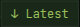

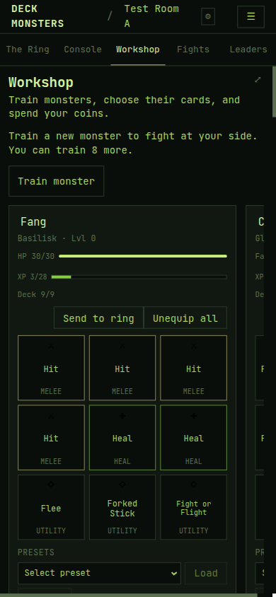

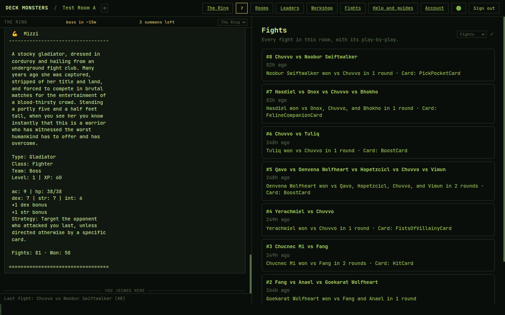

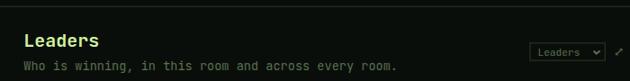

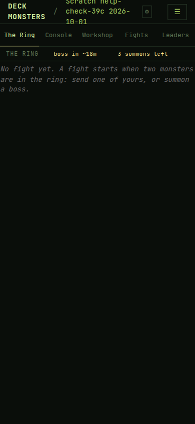

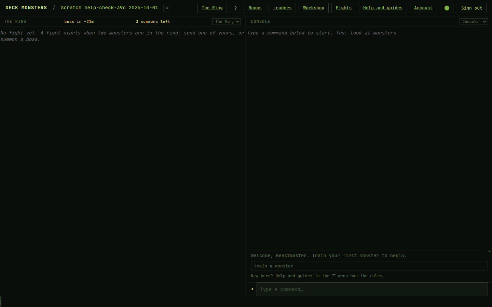

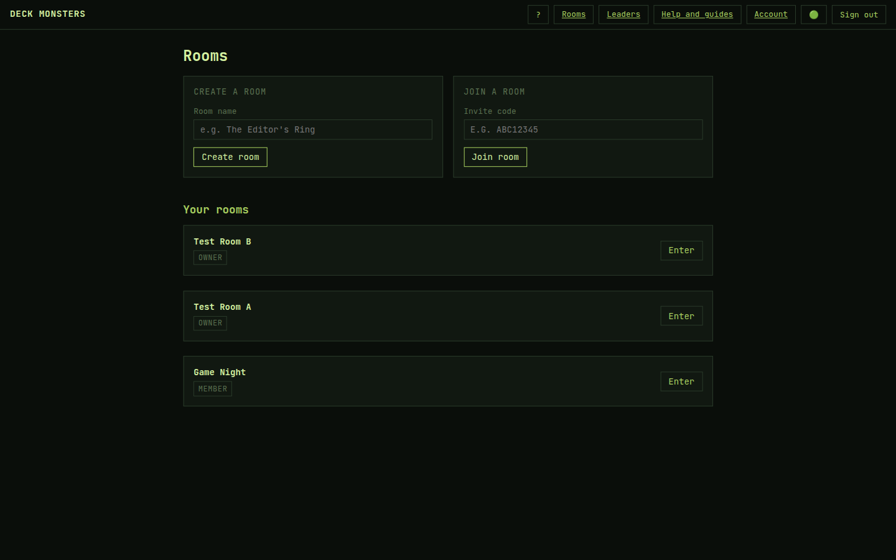

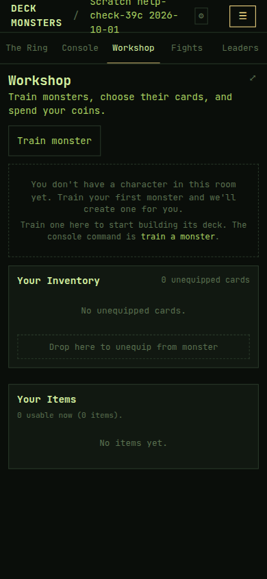

## C. First-time fight notes

| Item | Result | What was on screen |
|---|---|---|
| 11. First temperament note | Pass for the first boss. Second arrival not reached | The line under the first boss was `ⓘ Every boss has a temperament that decides which challenger it goes after. The line above says this one's.` It was in the Ring. The Console had no `.mechanic-note`. |
| 12. Reload | Pass | After reload, `.mechanic-note` count was 0. The visible boss card has no note under it. |
| 13. Ring event | Not reachable | `trigger event blood-feud` and `trigger event gauntlet` both ran and were refused because the roster does not meet the event. No banner, so no note. |
| 14. Ambush and rivals | Not seen | Neither phrase is in Test Room A's ring history (155 events), and neither appeared during the watched fight. |
| 15. Note on the newest line | Pass | After clearing `mechanicsExplained:*` and reloading, the landed view showed the note on the temperament line, and storage held `boss-temperament`. One note. |

The second summon, while Fang was the only challenger and a boss was already facing them, replied: `Every challenger in the ring already has a boss to face. Bring a friend into the ring, then summon another.` A later arrival was not staged after that.

Refusals, exact:

- `Blood Feud cannot be forced right now — the current roster does not meet its requirements (need: blood-feud).`
- `The Gauntlet cannot be forced right now — the current roster does not meet its requirements (need: gauntlet).`

The first reload, still during the fight, also found no note: the landed rows were later fight lines, and the temperament row was not mounted. The check in item 15 was repeated once the fight had finished and that row was the one on screen.

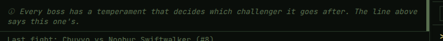

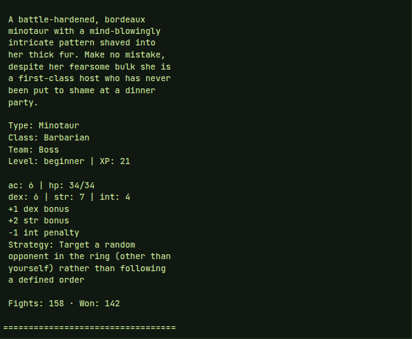

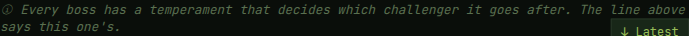

The same note also showed under the first boss in the throwaway room, in the Ring, while the Console was on the equip step:

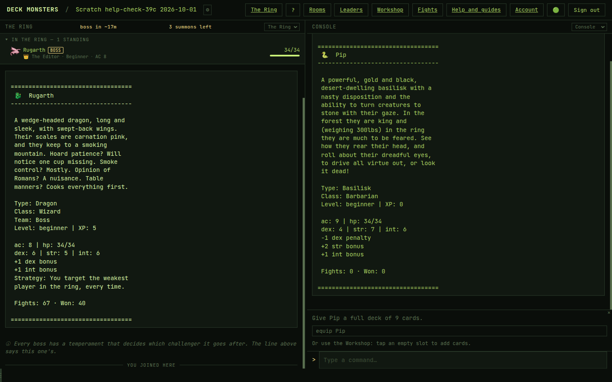

## D. Guided start

Phone first, in a new room. Desktop shots of the Console guide were taken at the equip step and the waiting step; the sentences matched.

| Item | Result | What was on screen |
|---|---|---|
| 16. First Console guide | Pass | `Welcome, Beastmaster. Train your first monster to begin.` with chip `train a monster` and hint `New here? Help and guides in the ☰ menu has the rules.` The Workshop has the first-run form and no guide box. |
| 17. After training Pip | Pass | Console: `Give Pip a full deck of 9 cards.` chip `equip Pip`. Workshop: `Give Pip a full deck: tap an empty slot to add cards until all 9 are filled.` |
| 18. Deck filled in the Workshop | Pass | Nine cards equipped with Equip 9 to Pip. Console: `Pip's deck is full. Send Pip to the ring.` chip `send Pip to the ring`. Workshop: `Pip's deck is full. Press Send to ring.` |
| 19. Sent | Pass | Console waiting sentence, chip `summon a boss`, hint `You can summon 3 bosses a day.` Workshop: `Pip is in the ring. A fight starts when a second monster joins. Nobody else here? Type summon a boss in the Console.` |
| 20. Fight finished | Pass | Pip lived (13/34 after the fight, 1 battle). Console and Workshop both showed the change-a-card step, exact text, chip `help unequip`. |
| 21. Card moved | Pass | Tapped one of Pip's cards, then the inventory drop zone. `Unequipped 1 card from Pip.` Both guides were gone. |
| 22. Memory | Pass | Reload: still gone. Test Room A Console: no guide box. A second new room showed the welcome guide on its own. After training Nib there, the Workshop guide was up; ✕ in the Console removed it from the Workshop too. |
| 23. Hide during a question | Pass | With `equip Nib` open, the Workshop guide is gone and the paused banner is up. Cancel brings the guide back. |

`summon a boss` in the first throwaway room was refused with the same "already has a boss" sentence, because the timed ring boss (Rugarth) was already standing when Pip was sent. That fight is the one that finished.

The Workshop learns about an open Console question on its flow-status poll. At one second the guide was still on screen. From two seconds through eight seconds it was gone. The passing shot is the settled state.

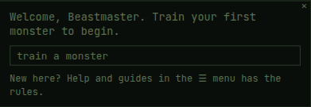

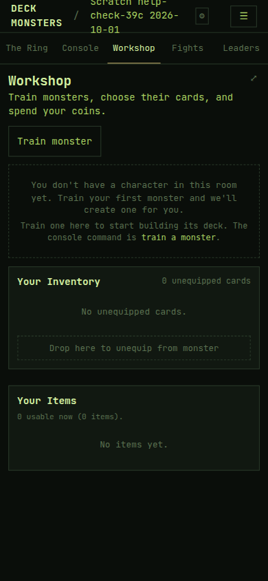

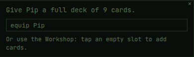

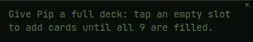

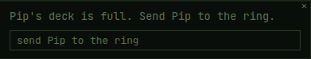

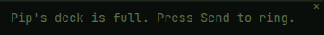

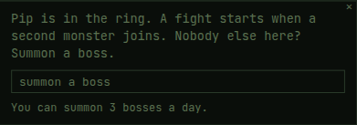

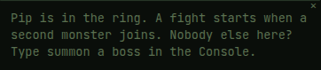

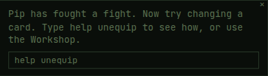

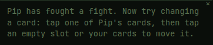

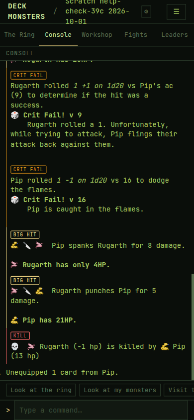

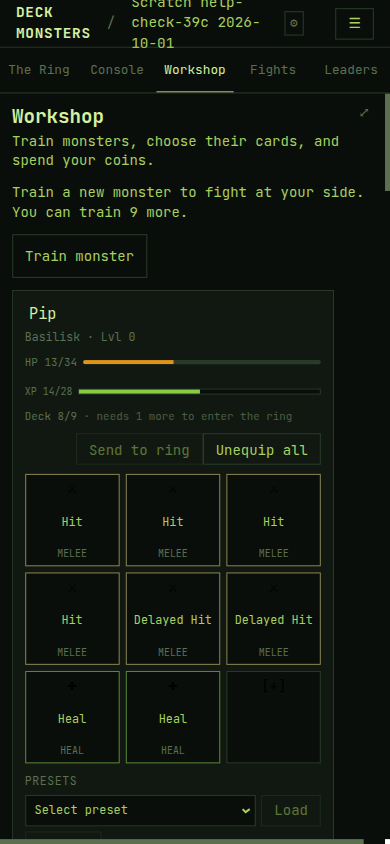

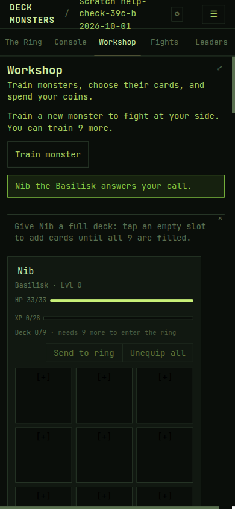

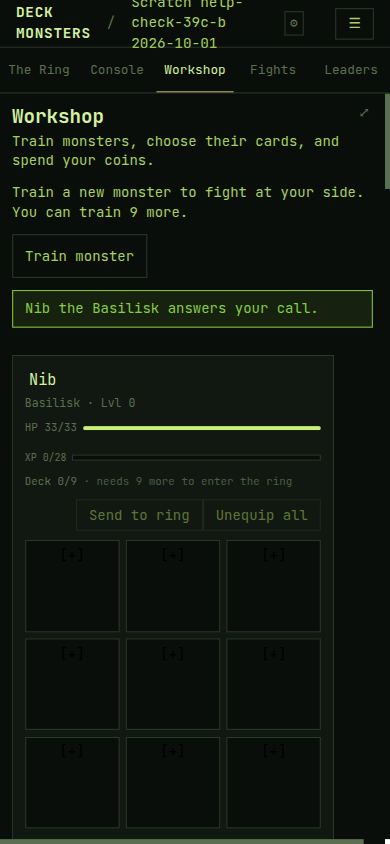

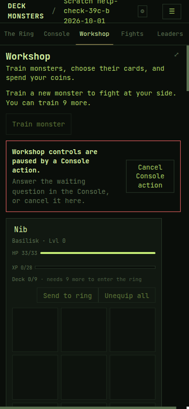

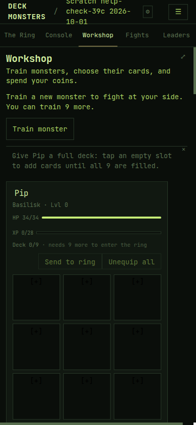

## Fixed on the way

None. No code fix. The blank login page at the start of the session was a Vite process left over from before this branch; restarting it served the current app.

## Strings for Claude

None. No `DRAFT(39)` placeholder.

## Not reached

- **A second boss after the first temperament note.** The only extra summon was refused because one boss was already facing the only challenger. The "shows no note" clause was not seen on a second arrival.
- **A ring-event note.** Blood Feud and The Gauntlet were both refused for roster requirements. The checklist's admin refusal did not occur; the commands ran and the events did not start.
- **Ambush and "the bosses turn on one another".** Not in the watched fight and not in Test Room A's ring history.

## Anything else confusing

Phone Console chips run off the right edge. `Equip Fa` is the visible part of `Equip Fang`.

Fight rows name cards by class: `Card: PickPocketCard`, `FelineCompanionCard`, `BoostCard`, `FistsOfVillainyCard`, `HitCard`.

The Command reference control's title is the words `Command reference` and nothing about what the button opens.

The Workshop guide stays up for about a second after a Console question opens, until the flow-status poll marks the Console flow active. The shot just above item 23 is that second.
