# Live check of Workshop fixes and in-game Help

Checked on 2026-09-30 against the running web app, on branch `cursor/help-check-39`.
Viewports were 390×844 and 1440×900. Test Room A and Test Room B were used for the
Workshop, Shop, and Help pages. A throwaway room, `Scratch help-check 2026-09-30`, was
used for the fight and then deleted. Game Night was not opened.

Judged against the strings that shipped, which differ slightly from the older lines in
[39a](../archive/roadmap/39a-cursor-first-pass.md). Revival reads `Fallen · back at {time} (in 12 min)`,
or `in 2 h 15 min` for a long wait; `Fallen · back in {s} s` (never above 59) in the last
minute; and `Fallen · almost back` once the time has passed. A full roster reads
`(1 monster)` or `(N monsters)`. Help is the menu entry **Help and guides**, and it is
not a tab.

`documentElement` and `body` overflow (`scrollWidth - clientWidth`) was 0 at both widths
on the Workshop, the Shop, every Help section, and Test Room B.

## Part 1 — Workshop fixes

| Item | Result | What was on screen |
|---|---|---|
| 1. Coins live in the Shop only | Pass | The Workshop header has no balance and no wallet, at both widths. The Shop wallet read `44 coins` in Test Room A, and `0 coins`, then `10 coins`, then `15 coins` in the scratch room. A priced button read `30 coins`. |
| 1. Singular `1 coin` | Not checked | No balance of 1 was on screen. |
| 2. Train row, free places | Pass | `Train a new monster to fight at your side. You can train 8 more.` The button stayed **Train monster**. At 390px the row is a column and the button is full width. At 1440px the sentence and the button sit on one row. |
| 2. Full roster `(1 monster)` / `(N monsters)` | Not checked | Eight places were free of ten. The disabled full-roster button was not on screen. |
| 2. First run | Pass | Test Room B showed today's empty copy and a **Train monster** button, with no count line, at both widths. No character was created. |
| 3. Sync removed | Pass | No Sync button at either width. |
| 3. Refresh after a fight | Pass | See [Fight end](#fight-end). |
| 4. Free reads Free | Pass | Sorting Hat's button was **Free**. The confirm dialog was `Take the Sorting Hat? It's free.` The page then read `You took the Sorting Hat. It was free.` The priced confirm, dismissed, was `Buy Chocolate Bar for 30 coins?` |
| 5. Sorting Hat description | Pass | The phone Shop row showed the three paragraphs in full, starting with `Join a team, switch teams, or leave one.` The description was not cut off. |
| 6. Fallen, no timer | Pass | Before Revive, Fang was `Fallen` with **Revive** enabled. That is the state where `revivesAt` is absent. |
| 6. Revival in progress | Not checked | The only fallen monsters were level 0. Wait is level × 10 minutes, so the next paint was already alive. See [Revival](#revival). |
| 7. Subtitle | Pass | `Train monsters, choose their cards, and spend your coins.` at both widths. |

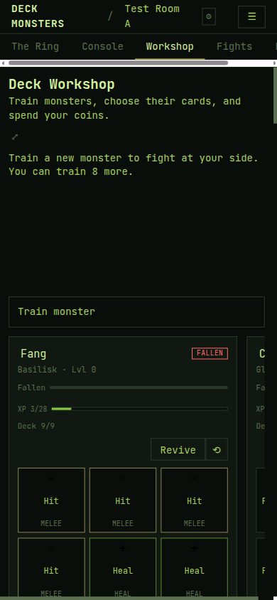

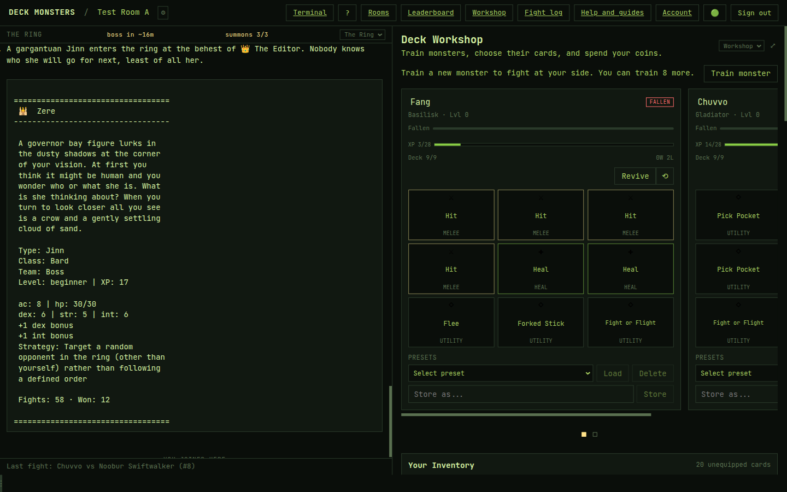

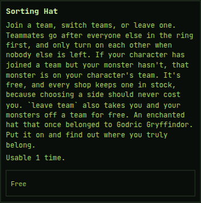

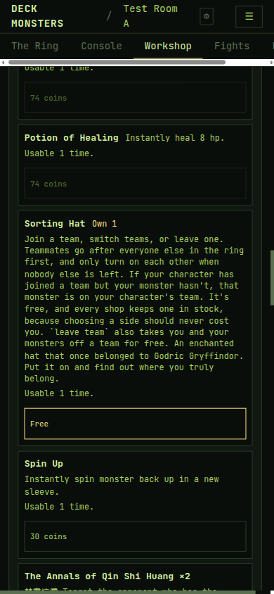

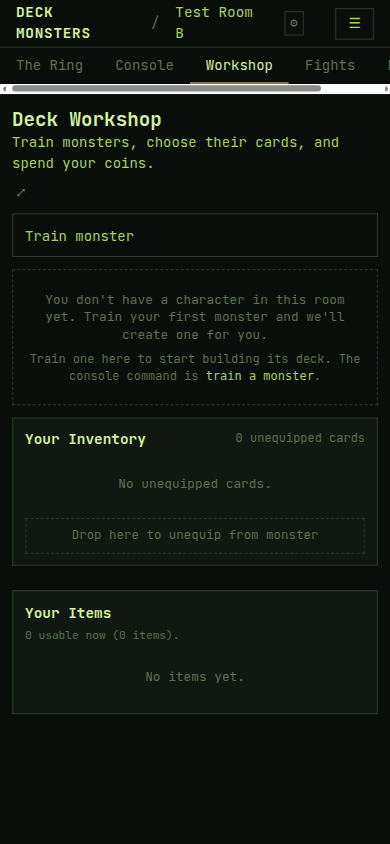

### Refresh events

From [workshop and items](../architecture/workshop-and-items.md#client-invalidation), and from what this check saw:

| Trigger | Seen in the browser |
|---|---|
| 30 s poll on inventory and shop | Yes. During the scratch fight, `game.shop` returned 200 about every 30 seconds while the wallet stayed `10 coins`. |
| Private `ring.xp` when a fight pays out | Yes. At 14:47:25 UTC the fight resolved, Ada's `ring.xp` granted 5 coins, and `game.shop` and `game.myInventory` both returned 200 in that same second. The next 30 s shop poll would have been about 24 seconds later. The wallet changed from `10 coins` to `15 coins` with the Workshop left open. |
| `refetchOnWindowFocus` | Not exercised. The hook sets it; this check did not blur the tab. |
| Revival timer (`revivesAt` + 1 s) | Not exercised. No room event exists for a revival finishing, and both revivals completed with a zero wait, so the scheduled refresh never mattered. |
| A separate level-up event | Not found, and not required. Level-ups ride the same `ring.xp` event. No level-up was on screen (Fang was 3/28, Pip gained 1 XP per fight). |

`visibilitychange` is on the ring feed hook, which reconnects the feed. The Workshop path is `refetchOnWindowFocus`, not a second visibility listener.

### Revival

Fang in Test Room A was fallen, level 0, XP 3/28, deck 9/9. **Revive** was enabled and the status was `Fallen`. After the click the card read `HP 1/30` and **Send to ring**, and the page said `Fang has begun to revive.` The inventory payload after that click was `{ dead: false, revivesAt: null, hp: 1, level: 0 }`. The in-progress strings (`Reviving…`, `Fallen · back at …`, `Fallen · back in {s} s`, `Fallen · almost back`) never appeared, because a level-0 wait is 0. The same thing happened to Pip in the scratch room: the console said they would be revived instantly, and `revive Pip` then answered `You don't have any monsters to revive.`

`revivesAt` was not set merely because Fang was dead. The button was **Revive**, not **Reviving…**, until the click, and the following payload had `revivesAt: null` because the monster was already alive.

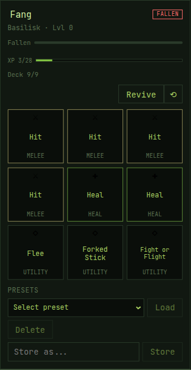

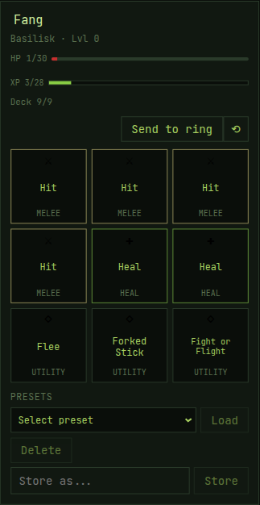

### Fight end

In the scratch room, Pip (Basilisk) lost to Ele (Jinn) in one round. The Workshop stayed the right pane. The ring then read `Ele wins!` and `The fight concluded with 1 dead after 1 round!` The Shop wallet on that same screen read `15 coins`. It had read `10 coins` from the moment the fight was summoned until the resolve. Ada's `ring.xp` text was `Ada gained 1 XP and 5 coins` plus `New player bonus: 3 coins.` (2 for the defeat and 3 for the bonus).

An earlier fight in the same room (Pip vs Irenim Sharpmind) also ended and paid 10 coins, but the browser had been closed, so that payout was only seen on the next load. It is not the evidence for a live refresh.

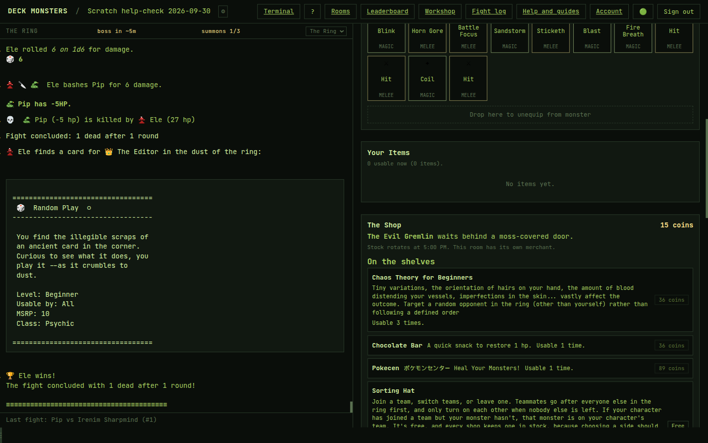

## Part 2 — Help inside the game

| Item | Result | What was on screen |
|---|---|---|
| 1. Menu entry, not a tab | Pass | **Help and guides** is in the ☰ menu at 390px and in the header at 1440px. The phone tabs are The Ring, Console, Workshop, Fights, and Leaders. The pane selectors at 1440px are those same five. Help is not among them. The route was `/room/<Test Room A>/help`. |
| 1. Sections, in order | Pass | How to play, Monsters, Cards, Items, Commands. How to play rendered the Player Handbook. Commands rendered the command table, including `train a monster` and the JSON-array equip example. |
| 2. Intro line | Pass | `Everything the game does, written down. New here? Start with How to play.` |
| 3. Readable at 390px, page does not scroll sideways | Pass | Page overflow was 0 on every section. Headings wrapped. The Commands table fit inside the page (`scrollWidth` of its box equalled the box). |
| 3. A wide table scrolls inside its own box | Not checked | No open table was wider than its box, so the inner scrollbar was not exercised. The page still did not grow. |
| 4. Design recorded | Pass | [web workspace](../architecture/web-workspace.md#help-and-guides) says Help is a route, not a surface, that the guides are Vite `?raw` imports, that Commands uses `COMMAND_CATALOG`, and that `pnpm run build:docs` then a web build refreshes the text. |

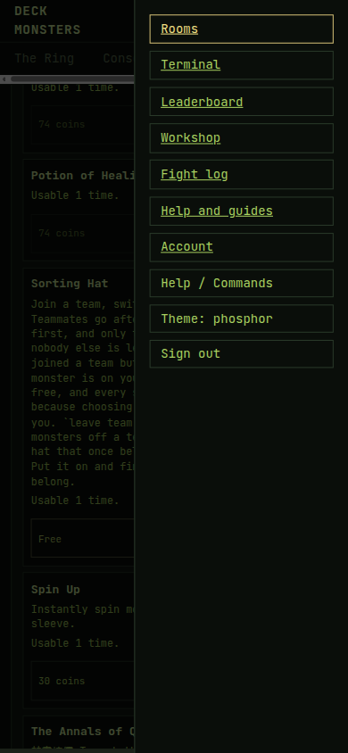

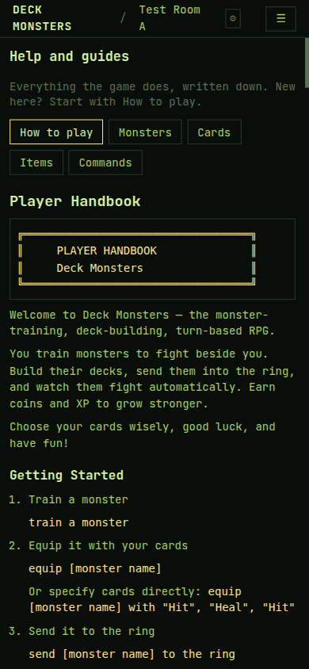

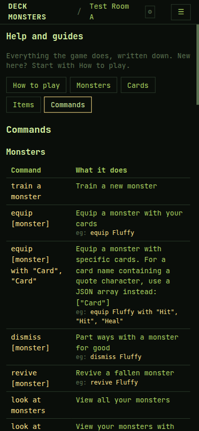

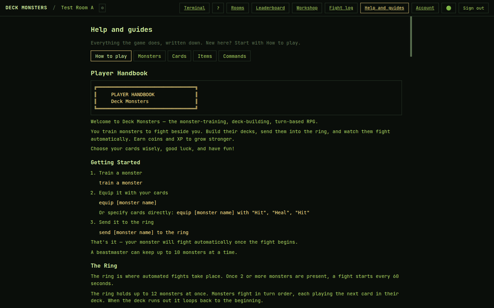

The phone tab bar itself scrolls sideways (Leaders is clipped). That scroll is inside the tab bar. The page did not scroll sideways. Help was left out of that bar on purpose.

## Rooms after the check

Test Room A now has Fang alive at 1/30 HP, and one Sorting Hat in items. Chuvvo was already fallen and was not revived. Test Room B still has no character. The scratch room was deleted. Details are in [local testing](../operations/local-testing.md#reusable-rooms-remote-test-account).

## Fixed on the way

None. Nothing failed in a way a small, no-new-text change would fix. The unseen revival lines need a monster of level 1 or higher (a 10 minute wait per level). Manufacturing that, or a 1-coin balance, or a full roster of 10, would be a new scenario rather than a fix.

## Strings for Claude

None.

## Not checked

- Shop wallet text `1 coin`.
- Full-roster copy `(1 monster)` and `(N monsters)`, and the disabled **Train monster** button that goes with it.
- `Reviving…`, `Fallen · back at {time} (in 12 min)`, `in 2 h 15 min`, `Fallen · back in {s} s` ticking each second, and `Fallen · almost back`.
- A Help table that is wider than its box, scrolling inside the box.
- A real tab blur to fire `refetchOnWindowFocus`.
- A level-up announcement on screen.

Rooms would not load until `rooms.state_generation` existed. The additive column from `supabase/migrations/20260930130000_room_state_generation.sql` was applied on the database this environment uses. That is setup, not a Part 1 or Part 2 failure.
