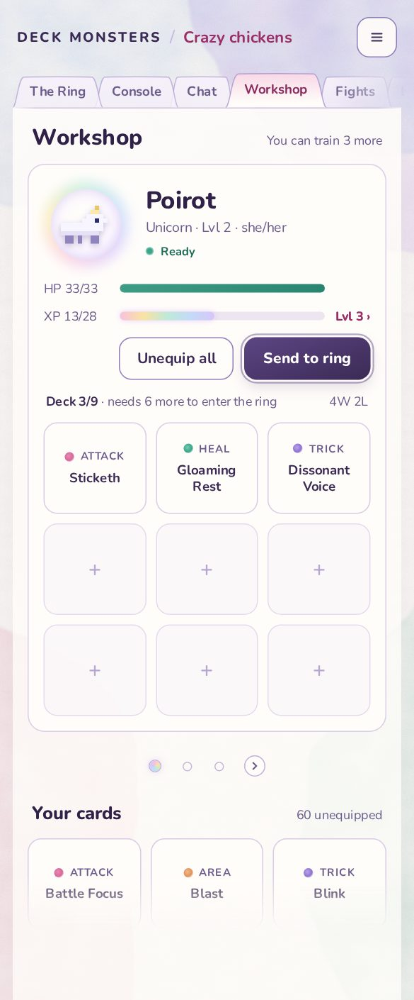
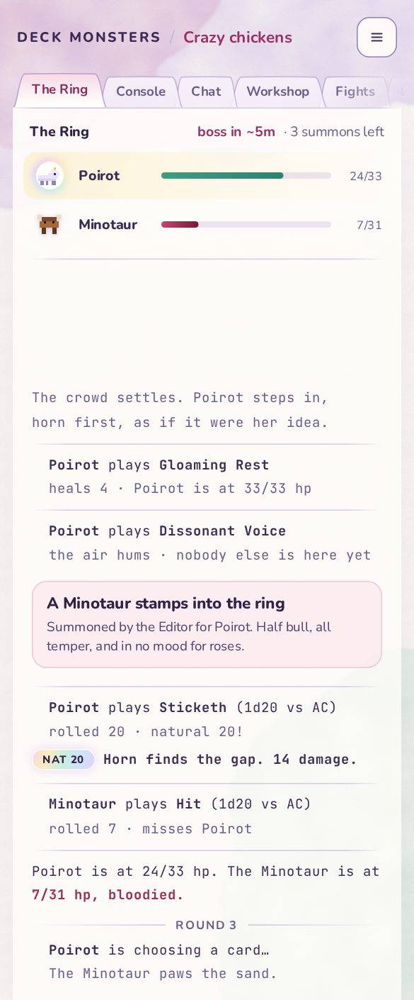
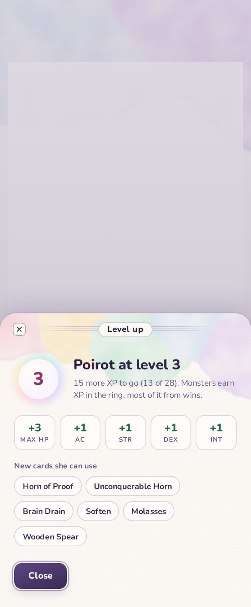
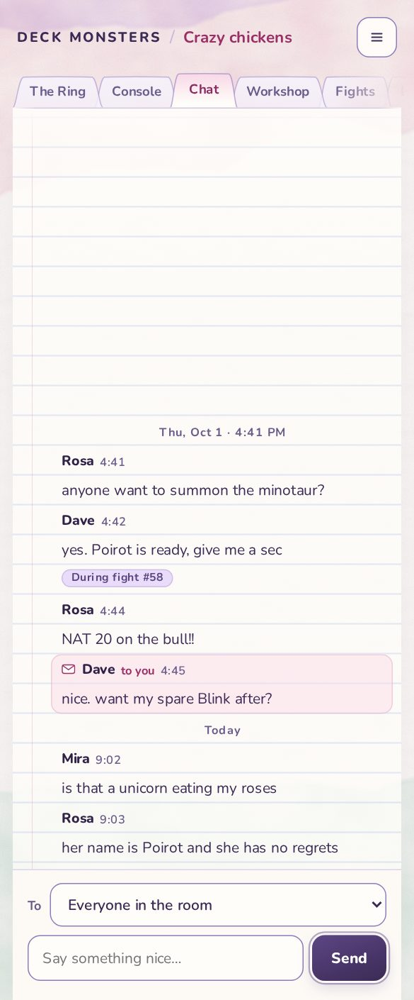

# Millefleur design system

The design is final as of 2026-10-06. The theme is built on the branch recorded in
[roadmap 46](../../roadmap/46-unicorn-theme.md); the live check is
[46b](../../roadmap/46b-cursor-check.md). Flavour lines (task 9) are not in the Ring yet.
This page is the reference the theme is built toward. Read [the brief](README.md) first for
what the theme is for; [process](process.md) explains how it got here.

The four final screens are in [samples/](samples/). Each is an HTML page you can open, with a
render beside it. They are the visual source of truth. Where this page and a sample disagree,
fix whichever is wrong and record why.

| Workshop | The Ring | Level-up sheet | Chat |
|---|---|---|---|
|  |  |  |  |

## Principles

1. **One voice.** One typeface for the interface and one for the fight transcript, one panel
   style, one primary button, one highlight colour. If two things look different, they must mean
   different things.
2. **Paint does the work.** Watercolour and paper texture carry the beauty, so the components can
   stay quiet. No icons, doodles or stickers unless they mean something.
3. **Transparency where the paint should show.** Pages and cards are translucent paper, so the
   washes glow through, faintly, behind content.
4. **The terminal shows through.** The Ring and Console keep JetBrains Mono. The game's monospace
   transcript is part of its identity; the paper around it is the change.
5. **A nod to System 7, softened.** The sloped folder tab, the pinstriped title bar, the square
   close box and the double ring around the default button all come from classic Mac OS. They
   are drawn soft and lilac, not black.

## Colour

All values are checked against the WCAG 2 contrast formula. "Paper" is the page ground
`#fbf8f5`; "page" is translucent paper over it; "rose tab" is the selected tab's top.

### Ink

| Token | Hex | Use | Paper | Page | Rose tab |
|---|---|---|---|---|---|
| `--mf-ink-heading` | `#2f2147` | Headings, monster names, names in chat | 13.89 | 14.35 | 11.16 |
| `--mf-ink` | `#3b2a55` | Body text, feed text, labels | 12.04 | 12.44 | 9.68 |
| `--mf-ink-muted` | `#695c8c` | Secondary text, timestamps, unselected tabs, captions | 5.65 | 5.8 | 4.55 |
| `--mf-rose` | `#9a2f66` | Room name, links, timers, "Lvl 3 ›" | 6.68 | 6.90 | 5.37 |
| `--mf-rose-deep` | `#8a2a5e` | The selected tab's label | 7.71 | 7.97 | 6.20 |
| `--mf-ok` | `#1f6b57` | "Ready", stat gains | 6.02 | 6.22 | 4.84 |
| `--mf-danger` | `#a12a4f` | Bloodied, errors | 6.71 | 6.93 | 5.39 |
| `--mf-label` | `#5a4380` | Text on lilac pills ("During fight #58") | 7.79 | 8.04 | 6.26 |

Every text pair here is at least 4.5:1. The first renders used `#7d72a0` and `#8a7fa8` for muted
text; at 4.2:1 and 3.5:1 they failed and were replaced by `--mf-ink-muted`. Do not bring them
back for a softer look; soften with size or weight instead.

### Paper and lines

| Token | Value | Use |
|---|---|---|
| `--mf-paper` | `#fbf8f5` | The ground under everything |
| `--mf-page` | `linear-gradient(rgba(255,253,250,.9), rgba(255,253,250,.74) 220px)` | The page each tab opens onto: nearly opaque at the top for reading, thinner lower down so the paint shows |
| `--mf-card` | `rgba(255,253,250,.9)` | Cards on a page (the monster panel) |
| `--mf-line-soft` | `rgba(190,170,215,.55)` | Decorative edges: cards, slots, gain tiles, chips |
| `--mf-line-tab` | `rgba(150,125,195,.5)` | Tab outlines, the page's top edge |
| `--mf-line-control` | `#8f7cbc` | Edges that identify a control: text fields, selects, secondary buttons (3.6:1, above the 3:1 for non-text) |
| `--mf-rule` | `rgba(140,170,220,.24)` | Chat's ruled lines |
| `--mf-margin` | `rgba(232,160,190,.4)` | Chat's margin line |

### The five washes

The palette for paint is five watercolours. In the Unicorn Tapestries the dyes were weld
(yellow), madder (red) and woad (blue), mixed into the rest
([The Met](https://www.metmuseum.org/art/collection/search/467640)); these are those dyes
diluted, and the theme's rainbow always runs in this order.

| Wash | Hex (paint) | Hex (tint, for UI) |
|---|---|---|
| Madder rose | `#f1c6d8` | `#fbd9e6` |
| Weld butter | `#fae2a8` | `#fbefc8` |
| Woad + weld sea-foam | `#c4e6d8` | `#cdeee2` |
| Woad sky | `#cfe1fa` | `#d6e6fb` |
| Woad + madder lilac | `#dcc8f7` | `#e3d4fa` |

The **holo** gradient is the same five as tints, in order:
`linear-gradient(110deg, #fbd2e4, #fbecbe, #c9eedf, #cfe2fb, #e0d0fb)`. It is used only on
moments that earn it: the XP fill, the halo, the active carousel dot, the nat-20 tag and the
level-up sheet's header. Never on a whole surface, never on something always on screen except
the XP fill.

### Meters

| Meter | Fill | Track | Note |
|---|---|---|---|
| HP, healthy | `#3f9c84 → #2a8570` | `rgba(190,170,215,.28)` | 3.7:1 against the track |
| HP, critical | `#c0476f → #7a1838` | same | 8.5:1 |
| XP | the holo gradient, with a soft glow | same | Decorative; the figures beside it ("XP 13/28") carry the information |

## Type

| Role | Face | Size and weight |
|---|---|---|
| Interface | **Nunito** | Body 14/400, labels 12–13/700, headings 21–23/800, the wordmark 13/800 at `.14em` tracking |
| Fight transcript and Console | **JetBrains Mono** (as today) | 12.5 at 1.65 line height |

Two faces only. The first rounds tried Fraunces italic for headings and a handwriting accent;
both were cut as "kitchen sink". Small caps labels (ATTACK, MAX HP) are Nunito 700 at 10px with
`.06–.07em` tracking.

## Texture

The backgrounds are painted, not drawn. The full recipe is [tools/paint.svg](tools/paint.svg).

- **Shapes:** large irregular paths that bleed in from an edge or a corner and are cut off by it.
  Never circles, ellipses or shapes floating in the middle: those read as blobs. Two or three
  per screen, plus one quieter accent lower down.
- **Wash filter:** a slow turbulence warps the shape, a fine one wets its edge, a cloud noise
  makes the pigment uneven inside, and an eroded ring adds the slightly darker edge where
  watercolour dries. Little blur: blur makes airbrush, not paint.
- **Glazing:** each layer is drawn with `mix-blend-mode: multiply` at about 50%, so where two
  washes overlap the colour deepens like a real glaze.
- **Paper:** a faint fibre noise (slope .05) and a fine grain (at .45), both multiplied over
  everything, cards included.
- **In the app:** bake each screen's washes into a WebP once. Do not run these filters live on
  every frame (roadmap 46 has the budget).

Compositions in the samples: the Workshop has sky and lilac glazing over the top with rose low
on the left and sea-foam low on the right. The Ring has lilac over the top, a rose corner and
sea-foam low on the right. Chat has rose and lilac over the top and a sea-foam ground. The
level-up sheet's header is all five washes running into each other.

## Components

Measurements are CSS pixels at a 390-wide phone.

### Header

Transparent over the paint. The wordmark (`DECK MONSTERS`, ink, 13/800, tracked), a `/` in
`#c4b3e0`, the room name in rose 15/700 with an ellipsis, and the menu as a 38px secondary
button. Padding 16 at the sides.

### Folder tabs

The signature component. Each tab is an SVG path with **sloped shoulders**, like a manila
folder or a System 7 tab:
`M0 30 C4 30 6 3 12 1.5 C14 1 86 1 88 1.5 C94 3 96 30 100 30`, stretched to the label.

- Unselected: 30px high, 16px side padding, label 12.5/700 in `--mf-ink-muted`. Fill: paper
  `#f5f0f9` from .97 opacity at the top to .8 at the bottom. Outline `--mf-line-tab`.
- They overlap by 8px. Each sits behind the one to its left, so the shoulder lines never cross.
- Selected: 33px high, 18px padding, label in `--mf-rose-deep`. Fill: a rose wash `#f8d8e6`
  fading into the page colour `#fffdfa` by 85% of its height. It is drawn above the page's top
  edge and extends 1px below it, so it joins the page with no line under it.
- Colour marks only the selected tab. Every other tab is the same.
- The row starts 12px in, level with the page, and fades out from 80% of the width, so a tab
  cut by the screen edge fades instead of being clipped.

Why: the first tab designs (rounded rectangles with a gradient) read as early-2000s Aqua. The
slope is what reads as a folder.

### Page

What a tab opens onto. `--mf-page`, 12px from the screen edges, no side borders, a soft shadow
(`0 14px 34px rgba(110,85,150,.08)`). Its top edge is a 1px `--mf-line-tab` line that fades
out over its first and last 6%. The screen's heading lives inside the page, never between the
tabs and the page.

### Card

`--mf-card` with a 1px `--mf-line-soft` edge and 16px radius. Used once per screen at most (the
monster panel); everything else sits on the page directly.

### Buttons

- **Primary:** plum `linear-gradient(160deg, #5d4684, #3b2a55)`, white 14/800 text (7.9:1 or
  better), 12px radius, and the System 7 default ring:
  `0 0 0 2px rgba(255,253,250,.95), 0 0 0 3.5px rgba(93,70,132,.45)`, plus a soft drop shadow.
  One per view.
- **Secondary:** translucent paper, 1px `--mf-line-control`, ink 14/700, 12px radius.
- Hover styles only under `@media (hover: hover)` (bug 230).

### Fields and selects

Paper at .95, 1px `--mf-line-control`, 12px radius, 14px Nunito, 11–13px padding. Placeholder
text uses `--mf-ink-muted` at full opacity: the browser's default grey placeholder is about
2.3:1 on paper, below the 4.5:1 rule.

### Card slots

84px high, 13px radius, paper at .95 with a `--mf-line-soft` edge. The role is a 9px painted dot
(a radial gradient with a soft rim) plus its label: attack rose `#d7679a`, area apricot
`#e0925a`, heal sea-foam `#3aa58a`, trick lilac `#8f72d1`. Empty slots are lilac paper at .45
with a lighter edge and a `+` in `#b6a6d4`.

### The halo

A monster's portrait sits in a halo: a ring of the holo gradient blurred 6px, around an inner
disc of pearl paper (`radial-gradient(#fffdfa, #fbf7ff, #efe6fb)`) with a faint lilac inner
glow. 80px in the Workshop, 34px in the Ring roster, 76px around the level badge.

### Chips, pills and tags

- **Chip** (new cards in the level-up sheet): paper, `--mf-line-soft`, fully rounded, 12.5/700.
- **Pill label** ("During fight #58"): lilac `rgba(227,212,250,.8)`, `--mf-label` text, inset
  `--mf-line-soft`.
- **Nat-20 tag:** the holo gradient with a faint glow. The only tag that gets it.

### Ruled paper (Chat)

Each line of the log is exactly one 28px row, with the text's baseline 7px above the rule. The
rule is a 28px background tile (`background-size: 100% 28px`), **anchored to the bottom**
like the log, because a chat log grows upward from the composer. A margin line runs down the
left at 33px. A direct message is a rose band exactly two rows high (inset outline, no border,
so it does not break the rhythm).

Why the tile: an unsized `repeating-linear-gradient` fills the whole box and starts at the top,
so its lines drift from bottom-anchored text by whatever the box height is not a multiple of
28. That was the misalignment the owner saw on 2026-10-06.

### The fight transcript (Ring)

JetBrains Mono on the page. Separators are 1px lines fading at both ends; the round marker is a
small tracked label between two fading lines. The boss arrival is a rose-tinted card with an
inset edge. The log is anchored to the bottom, with older turns fading out towards the top.

### Sheets

The level-up sheet is the model for every bottom sheet.

- 24px top corners, a 1px `--mf-line-tab` edge, the page colour.
- **A painted header:** all five washes, glazed, fading into the sheet over its first ~130px,
  with paper grain.
- **A soft System 7 title bar:** pinstripes (`repeating-linear-gradient` of 1px lines every 3px
  at 22% plum) that fade at both ends, with the title centred in a paper pill.
- **A close box:** a 20px rounded square in a 44px hit target, top left, on the control that
  really closes the sheet.
- **Stat tiles:** five equal tiles, paper with `--mf-line-soft`, the gain in `--mf-ok` 17/800
  over a tracked label.

### Carousel dots and arrow

The active dot is a 10px holo disc with a faint glow. Inactive dots are 9px outlined circles in
`--mf-line-tab`. The next arrow is a 20px outlined circle with a chevron. Tap targets stay
28 × 36 and 36 × 36.

## Motion

None on the page. A sheet slides up as today. The halo and holo surfaces do not animate. Under
`prefers-reduced-motion`, sheets appear in place without sliding (roadmap 46 §7); nothing else
moves, so nothing else changes.

## Accessibility

- All text pairs at least 4.5:1 (table above). Control edges at least 3:1.
- Selection is shown by colour **and** by shape: the selected tab is taller and joined to the
  page.
- Card roles carry a word, not only a coloured dot.
- High contrast (`prefers-contrast: more`): drop the washes and grain, keep the shapes, and use
  `--mf-ink-heading` for every line. Roadmap 46 covers the token work this needs.

## Do and don't

| Do | Don't |
|---|---|
| Let one or two washes bleed in from an edge | Float round shapes in the middle of the screen |
| Use colour to mark the one selected thing | Give every tab or chip its own colour |
| Keep the transcript in JetBrains Mono | Swap the feed to a proportional face (it breaks the card frames and row heights) |
| Render and look before shipping a change | Trust the code; every round had faults only visible in pixels |
| Anchor ruled lines to the text they rule | Use an unsized repeating gradient |
| Add a doodle only if it means something | Decorate controls |

## In the app

Built in pass 46a of [roadmap 46](../../roadmap/46-unicorn-theme.md) as
`apps/web/src/styles/theme-millefleur.css`, a lazily loaded chunk with the Nunito faces. Where
the real app differs from the samples above, this is what was built and why:

- **The transcript uses the design's metrics.** The app now reads feed size, line height,
  spacing and character advance from the drawn CSS, so Millefleur uses 12.5px on a 1.65
  line. The renderer and row-height estimate share composed blocks; changes to a block's
  layout must be reflected in the measured metrics (bugs 159 and 196).
- **A fifth card role.** The engine has a guard role (labelled DEFENCE) that the samples did not
  show. Its dot is woad sky `#5f93d6`. Every role dot sits beside its word; the role glyph
  (⚔ ✚ ✦) is hidden in this theme, because the dot and word already say it.
- **Chat grows from the bottom.** The short log fills the available page above the
  composer; messages and the 28px ruled tile share the bottom anchor. Message times and
  bottom anchoring are also deliberate backports to the dark themes.
- **The XP bar stays decorative.** Its fill is the pale holo with a soft glow, as above, and is
  barely darker than its track on purpose: the "XP 13/28" figures beside it carry the
  information. A build pass gave it saturated stops and a plum outline so a filled bar would
  read as filled; the owner caught it as counter to the theme's softness (2026-10-06), and it was
  reverted. Don't harden a decorative surface to pass a contrast rule meant for information.
- **Where a contrast rule did apply.** The healthy HP gradient runs `#2c8873 → #2a8570` rather
  than from `#3f9c84`, so both ends are at least 3:1 on the track (HP is a meter the test
  enforces for every theme; the change is barely visible). Carousel dots and the empty slot's
  `+` are controls, so they use `--mf-line-control` (3.4:1), the same line as fields and
  secondary buttons, rather than the paler tab line of the samples. The `+` is the only cue that
  an empty slot is a button.
- **Folder tabs** fill from .97 to .92 rather than .8, because at .8 the neighbour's shoulder
  line showed through (a rendering fix, not a contrast one). When the row is wider than the screen, it scrolls to keep the selected
  tab in view and fades at whichever ends have more tabs.
- **The halo** surrounds Ring portraits, the Workshop portrait and the level-up badge.
  The portrait is also available in dark themes, without the Millefleur halo; the level
  badge stays hidden there by the owner's design decision.
- **Sheets** get the close box as a second, real close control (the sheet's own Close button
  stays at the bottom); it and the title bar stay visible while a tall sheet scrolls.

## Related

- [The brief and artist statement](README.md)
- [Process and learnings](process.md)
- [Roadmap 46: building it](../../roadmap/46-unicorn-theme.md)
- [Iteration archive](../../archive/studies/millefleur-theme/README.md)
- [Pixel art](../pixel-art.md) for the monster sprites, which stay pixel art in this theme
