# New-player walk 2

Played on 2026-10-04 at <https://deck-monsters.com> in a room created for this walk,
`Scratch new-player 2026-10-04`. The room was deleted at the end. Almost everything
below was at 390×844. The Workshop and The Ring were opened again at 1440×900.

The character is Ada (they/them, trident avatar). The first monster is Rex, a
Gladiator, because that type's line said it has the most HP and extra armour while
young. The second is Luna, a Unicorn, trained in the Workshop because that line said
it heals its allies, which only made sense once Rex existed.

Detours, in order: the empty Console said to look at monsters, and the guide said to
train, so training came first and the Workshop came after Rex's deck was full. Help
was opened in the middle of equipping, because the equip question would not explain
a card. Flee was moved from Rex to Luna, the eight-card deck was saved as the preset
`arena` and loaded back, and Hit was put in the empty slot so Rex could enter the
ring. A boss was already standing, so this walk never typed `summon a boss`.

## 1. The ten most confusing moments

### 1. The equip question will not say what a card does

Where: Console, while giving Rex a deck.

Exact text: `You have 9 of 9 slots remaining, and the following cards:` then
`5) Hit [4]`, and later `"look at Hit" is a command, not a card. Cancel this question first, then run it.`

What it seemed to mean: nine of nine sounded like the deck was already full. The
numbers in brackets looked like how many copies were selected. Typing the example
from the command list, `look at Hit`, should have explained Hit.

What it did: "remaining" means empty slots. Checking a name once adds that card once,
and the number on the button becomes the pick order (`[1]Hit`, `[2]Heal`). Hit's
`[4]` was how many copies were owned. The question stayed open, so the lookup was
refused. The effect text exists, far down Help → Cards.

What's missing: the effect, or a way to open it, on the choice itself.

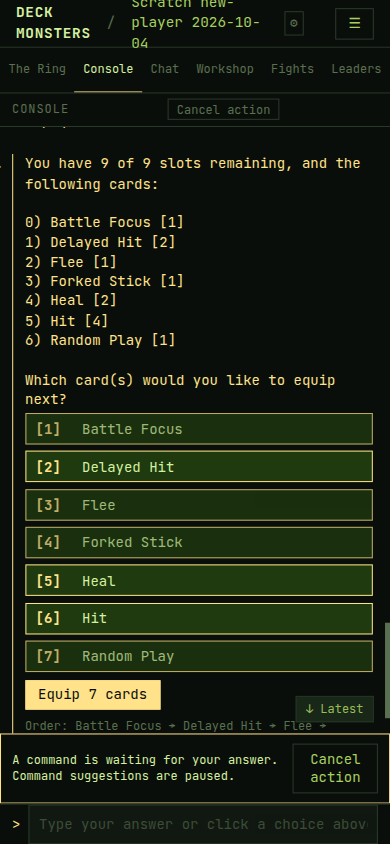

### 2. "Tap an empty slot" does nothing, and the new monster is off the phone

Where: Workshop, after training Luna.

Exact text: `Give Luna a full deck: tap an empty slot to add cards until all 9 are filled.`
Tapping `[+]` changed nothing. Tapping a card then showed
`1 selected: Flee. Tap destination slot or inventory drop zone.`

What it seemed to mean: the empty slot was the button, and Luna's deck was the card
on screen under that sentence.

What it did: the slot is only a destination. The card has to be selected first.
Luna's card sits in a sideways row, so at 390 the screen shows Rex and a sliver of
Luna. Two small dots under the row are the only hint that she is there.

What's missing: a first step that matches the control, and both monsters on a phone
without a hidden sideways scroll.

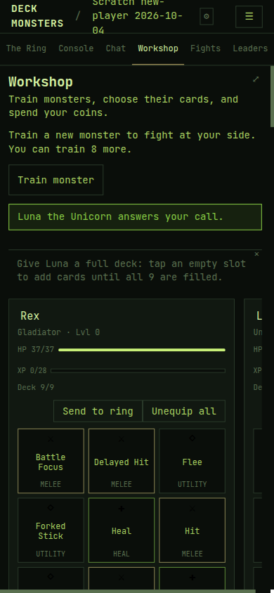

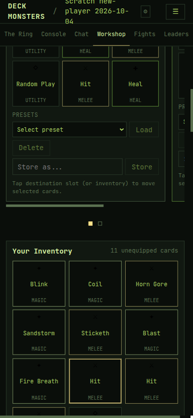

### 3. The guide said to summon a boss while the fight was already on

Where: Console, after `send Rex to the ring`, with The Ring showing `fight in 59s`
and `IN THE RING — 2 STANDING`.

Exact text: "The fight has begun! You may now type `look at monsters in the ring` to see all participants with their current stats, and `look at cards in the ring` to see the detailed stats of every card that will be in play."
Under that, the guide stayed: `Rex is in the ring. A fight starts when a second monster joins. Nobody else here? Summon a boss.`
During turns: `It's Ada's turn.`

What it seemed to mean: Rex was waiting alone, a summon was the next button, and
Ada's turn meant a card had to be chosen.

What it did: Razeth The White One was already in the ring. The countdown ran. Turns
played cards by themselves. The summon chip never went away. `You can summon 3 bosses a day.` stayed under it.

What's missing: the guide caught up to a fight that had already started, and "your
turn" is not a choice.

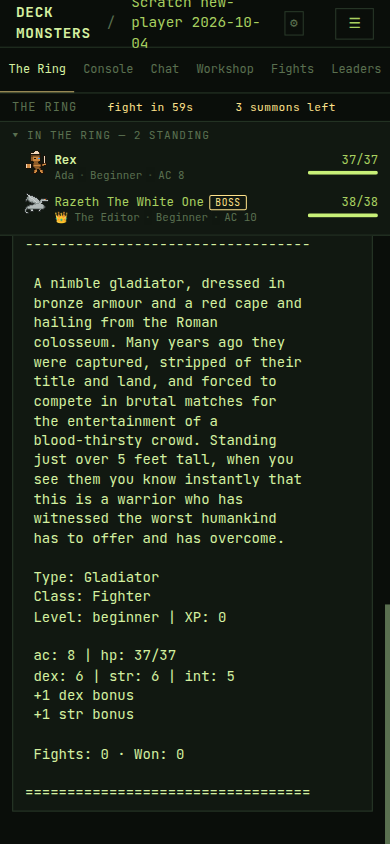

### 4. The fight log uses words and numbers that are not the fight

Where: The Ring, through the three rounds.

Exact lines, as they appeared:

- `The ancient scraps crumble in Razeth The White One's hands — and reassemble into something else...`
- `Rex pokes (in a not-so-facebook-flirting kind of way) Razeth The White One for 5 damage.`
- `Rex rolled 4 on 1d4 to determine how much to drink.` followed by `🎲 18` and `Rex grows stronger...` on a Heal.
- `2 HITS (5 total damage).` on a turn whose last line was `Miss...`
- `Hit chance: 74% | DPT: 3` and `MSRP: 20` on the Soften card at the end.
- `Fight concluded: 1 dead after 3 rounds`
- `Razeth The White One finds a card for 👑 The Editor in the dust of the ring.`

What it seemed to mean: scraps, a Facebook joke, a drink, and a shop price were
happening in the arena. "1 dead" did not say who. The card in the dust sounded like
loot for the boss.

What it did: those lines are card flavour, a die result that did not match the
sentence beside it, a running tally, catalogue stats, the win, and a card awarded
to the player. The clear lines were the rare ones: `Rex is now bloodied. Rex has only 18HP.` and `🏆 Razeth The White One wins!`

What's missing: a separation between flavour, the roll, and the result, and an end
line that names who fell and what the player received.

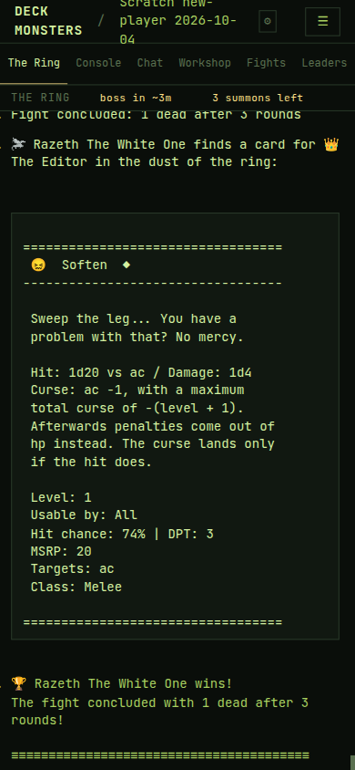

### 5. Revive said "instantly" and Rex came back at 1 HP

Where: Console, after the kill, then Workshop a few minutes later.

Exact text: `Rex has -3HP.` then `💀   Rex (-3 hp) is killed by  Razeth The White One (9 hp)` then `Rex has begun to revive. They are a beginner monster, and therefore will be revived instantly.`
`look at monsters` then showed `hp: 1/37` and `XP: 2`. The guide's next line was
`Rex has fought a fight. Now try changing a card.`

What it seemed to mean: negative HP was a display bug, and an instant revive meant
he was well.

What it did: he was alive at 1 HP. Nothing said he would heal while idle. By the
desktop Workshop he was `HP 16/37` and `XP 2/28`, still with no healing line.

What's missing: the HP he comes back with, and that it climbs on its own.

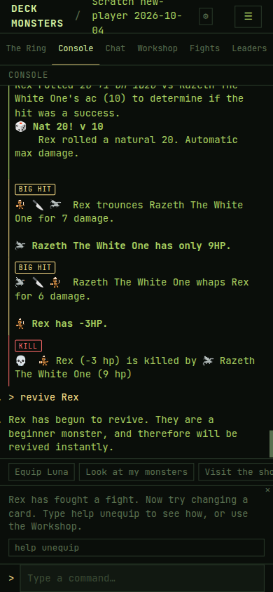

### 6. Buying an item uses the equip-cards button

Where: Console shop.

Exact text: `Choose one or more of the following items:` then `0) Sorting Hat [1] - 0 coins` and a button `Equip cards`. After picking the hat the button became `Equip 1 card`, titled `Equip the cards you picked, in the order you picked them.` Confirmation: `These fine items are available from The Shady Fairy for a mere 0 coins. Would you like to buy them? (yes/no)` Then `Sold! Thank you for your purchase, Ada. It was a pleasure doing business with you.` and `Ada has 10 coins.`

What it seemed to mean: Equip would put the hat on a monster. "These fine items"
did not name the hat. "A mere 0 coins" sounded like a joke total. Sold did not say
what was sold, and the coin line did not change.

What it did: it bought the free hat and left the 10 coins from the fight. The hat
was not on Rex.

What's missing: buy language, the item's name on the confirm and the receipt, and
where it went.

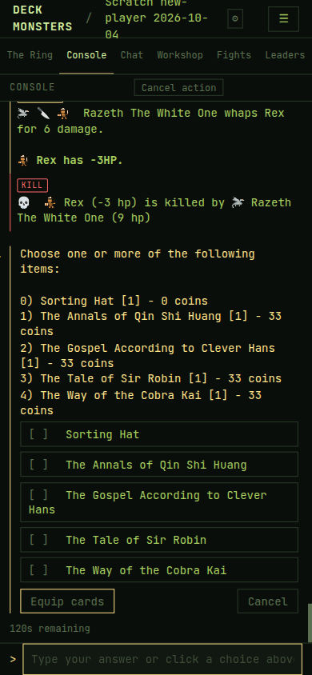

### 7. Help → Cards is a clipped catalogue, including a card named like a timestamp

Where: Help and guides, Cards, at 390.

Exact text at the top: `For item rules — timing, inventory limits, targeting strategies and the shop — see ITEMS.md.`
In the contents, between Pound and Random Play: `1993-09-7202 18:58`. Its block
lower down: `Buy a questionable round of milkshakes for everyone.`
Tapping the contents entry Battle Focus or Hit stayed in the name list. ASCII card
frames are cut off on the right. Real descriptions do exist further down (`A basic attack, the staple of all good monsters.`).

What it seemed to mean: ITEMS.md was a page in the game, and the timestamp was a
broken row. The names at the top were the descriptions.

What it did: ITEMS.md is a link label, not the Items tab sitting next to Cards.
The timestamp is presented as a card name. Descriptions are the same page, below
a long contents list that does not land on them.

What's missing: a card's effect at the name, and the Items tab named as the item
rules.

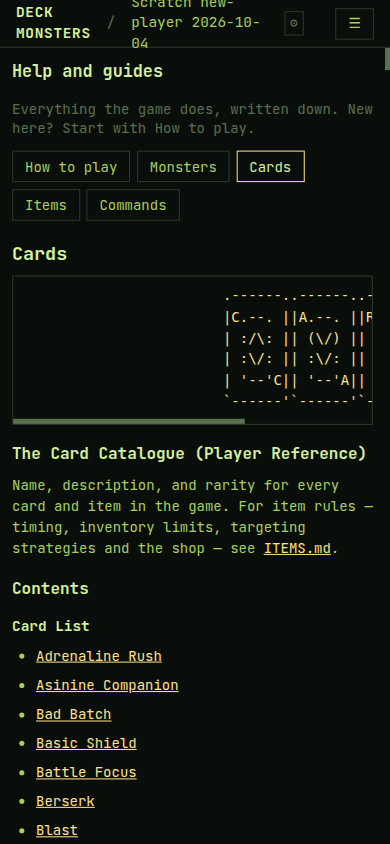

### 8. A boss arrived "at my behest" while the header said a boss was still coming

Where: The Ring, before anyone was sent, and again at 1440 after the fight.

Exact text: `boss in ~18m` and `3 summons left`, then `A fierce Dragon enters the ring at the behest of 👑 The Editor.`
After the fight the header went back to `boss in ~3m` and later `boss in ~13m`,
still `3 summons left`, and `An aged Minotaur enters the ring at the behest of 👑 The Editor.`
The boss card said `Strategy: You target the weakest player in the ring, every time.`

What it seemed to mean: another player named The Editor had summoned, a boss was
both here and 13 minutes away, and "You target" was an instruction to Ada.

What it did: The Editor is the name on this account. The timer boss arrives by
itself and does not spend a summon. "You" in the strategy is the boss.

What's missing: who called the boss, and that the timer is not the summon count.

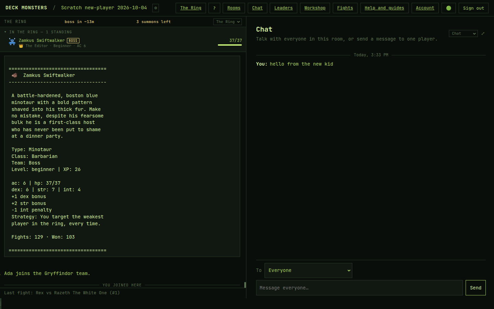

### 9. Answered questions stay up, and the next command hits a dead prompt

Where: Console, from the first equip through the shop.

Exact text, repeated: `This action timed out. Try the command again.` `The game stopped waiting for your answer. Try the command again.` `! Prompt is no longer active. Please answer the latest prompt.` `A command is waiting for your answer. Command suggestions are paused.`
Fight lines kept reprinting over the shop (`NAT 20`, `BIG HIT`, `KILL`) while a
new question was open. `look at items` after cancel printed the command and then
the guide, with no item list. `help` typed into the dead prompt was swallowed, and
only the next command ran.

What it seemed to mean: several questions were open at once, the fight was
happening again, and help had no answer.

What it did: old questions and highlights stay in the scroll. A dead prompt still
takes the next Enter. Cancel action is the way out, and it is easy to miss above
the fold.

What's missing: a finished question leaving the screen, and a command box that is
either in a question or not.

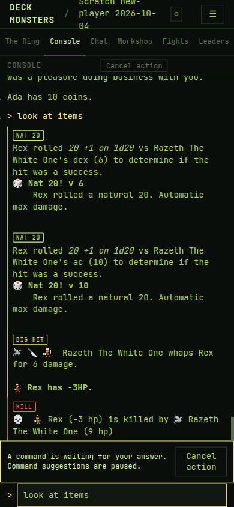

### 10. The monster I described is a paragraph and an emoji

Where: Console, end of training, `look`-style card.

Exact text on the empty Console, before that: `Type a command below to start. Try: look at monsters` and, in the guide, `Welcome, Beastmaster. Train your first monster to begin.`
The name question offered `Beastmaster-<id>` (an account fragment) and `type ok to be` that. Monster name suggestions were `Gacho, kazaerbo`. Garments example: `(eg: tattered rags)`. Typed garments: `bronze armour and a red cape`.
The card came back as prose (`dressed in bronze armour and a red cape`) plus `💪`,
`Type: Gladiator`, `Class: Fighter`, and `ac: 8 | hp: 37/37` with no legend.
Luna's coat line became `Their coat is a silver mane.` The Workshop appearance
field had already been filled with `gold and black` before anything was typed.

What it seemed to mean: look at monsters was the first command, the suggested
names were real options, and the garments would be the picture.

What it did: the guide is the real first step. The picture is an emoji and a
paragraph. Class and the five stats are never defined on the card.

What's missing: one first step, a name that is not an account id, and a legend for
the stats.

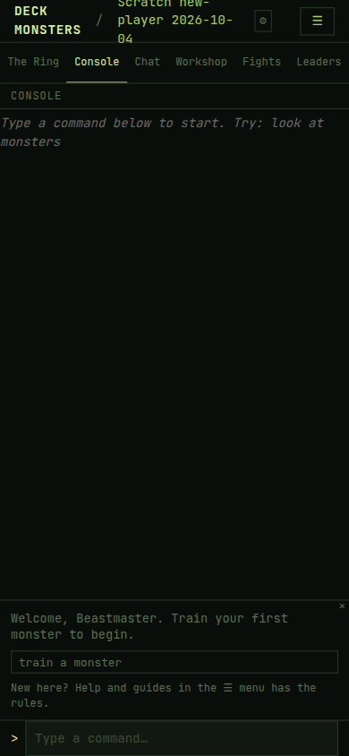

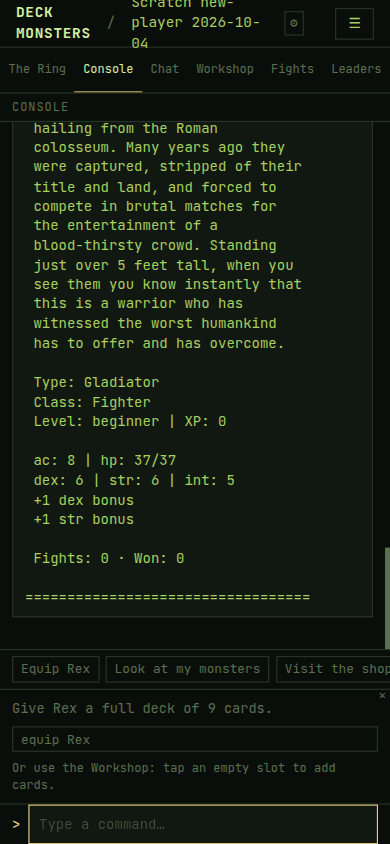

## 2. Everything else

| Place | What you saw | Why it confused you | Severity |
|---|---|---|---|
| Login | Tagline `Turn-based monster fights in the ring` | "The ring" is not a thing yet | small |
| Rooms lobby | Test Room A, Test Room B, Game Night, with OWNER or MEMBER | Nothing says those rooms are already in progress | slowed me |
| Room title at 390 | The new room's name wraps to three lines in the header | The tabs are pushed down and the name is hard to read | small |
| Training, avatar | A row of emoji with no labels, then Cancel | It is unclear that this is "you" and not the monster | slowed me |
| Training, type list | Basilisk's sentence was scrolled off the top of the phone | The first type is the one you cannot read | small |
| Console, equip | `Moved 1 cards from Rex to Luna.` | The count does not match the noun | small |
| Workshop, card move | `Blink can't go on Rex: that kind of monster can't use it.` | It does not say which kinds, or which of the inventory cards would work | slowed me |
| Workshop, Send to ring | The button is disabled. Its title is `Rex needs a full deck before entering the ring.` The visible line is `Deck 8/9 · needs 1 more to enter the ring` | On a phone the title never shows. The deck line does, once you notice it | slowed me |
| Workshop, presets | Store as `arena` fills the dropdown. Load has no sentence of its own. The deck quietly went from 9 cards back to 8 | It worked, and nothing said it had worked | small |
| Ring, boss card | `Fights: 10 · Won: 8` on a beginner dragon, later a minotaur with `Fights: 129 · Won: 103` | A first opponent looks like a veteran | small |
| Ring, join marker | `YOU JOINED HERE` appears in the middle of the live fight after a refresh | It reads as a new event | small |
| Ring, items | `Use an item (0 ready)` during the fight | There was no item, and no hint that items had to be given before the fight | slowed me |
| Console, after the fight | Coins are not mentioned. The shop is the first place: `with 10 coins in your pocket.` Leaders shows `XP 2` | The reward is invisible until you go looking | slowed me |
| Shop prices | Every item except the hat is 33 coins. Ada has 10 | Nothing affordable is left once the free hat is gone | slowed me |
| Using the hat | `Are you sure? (yes/no)` with no statement of what happens. Then four house names and `And just like that the Sorting Hat is gone and Ada joins the Gryffindor team.` | "Are you sure" does not say sure of what. The team is never defined | slowed me |
| Give | `give Sorting Hat to Rex` → `Ada doesn't have any items that Rex can use.` | The hat was already consumed. The sentence does not say that | slowed me |
| help heal | `No command has "heal" in it. Type help to see them all.` | Heal is a card you were just told to equip | slowed me |
| attack, heal rex, inventory | `! Command not recognized` | Those are the words the fight and the monster card suggest | small |
| help unequip | Lists `unequip Hit from Fluffy` and the count and all forms | This one is clear. The guide keeps showing the chip after you have run it | small |
| Fights | `#1 Rex vs Razeth The White One` and `Card: Soften`. The row did not open a play-by-play | "Card: Soften" looks like the card that won the match. The subtitle promises a play-by-play | slowed me |
| Leaders at 390 | Ada, XP 2, W 0, L 1. Further columns are off the right edge | Draws, win rate, and coins are advertised in the sort menu and not on screen | small |
| Items guide | Opens with `Items are Deck Monsters' bounded live-combat lever.` The rules under it are plain: 3 on you, 3 on a monster, nothing handed over mid-fight | The first sentence is not player language. The rules below it are the best item explanation in the game | small |
| How to play | `Once 2 or more monsters are present, a fight starts every 60 seconds.` | The countdown matched. The fight itself then ran for many minutes, which that sentence does not say | small |

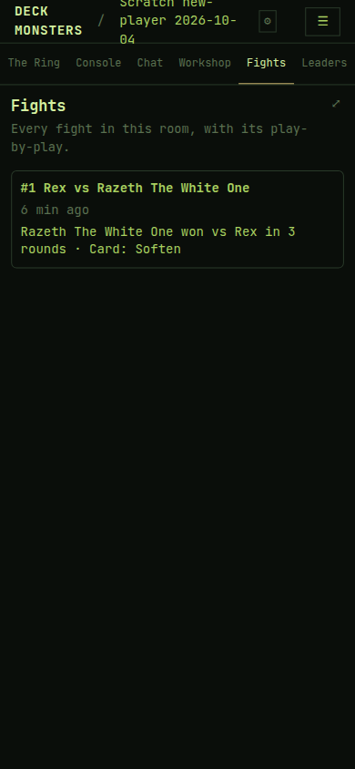

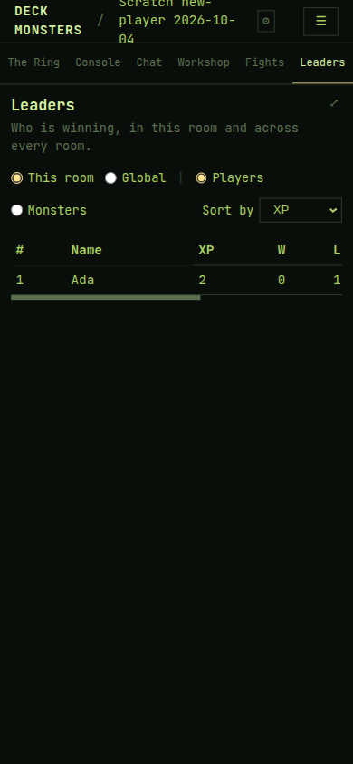

## 3. What worked

- Creating a room, and the guide chip `train a monster`, with `Help and guides in the ☰ menu has the rules.`
- Each monster type is one sentence. Gladiator's sentence was enough to choose it.
- The Workshop training form (type, pronouns, name, appearance, Train) is easier than the Console's one-question chain. At 1440, Rex and Luna sit side by side.
- `help unequip` answered with real examples.
- Moving a card, once the selection hint appeared. Saving `arena` and loading it put the deck back.
- `fight in 59s` is an understandable wait. `Rex is now bloodied. Rex has only 18HP.` and `Razeth The White One wins!` are understandable.
- A natural 20 is explained: `Rex rolled a natural 20. Automatic max damage.`
- Chat is a normal message box (`To Everyone`, `Message everyone…`, Send). `msg hello from the new kid` showed up as `You: hello from the new kid`. `dm Ada good luck` answered `That's you. Pick someone else.`
- The Items guide, after its first sentence, says when an item can move and when it cannot.

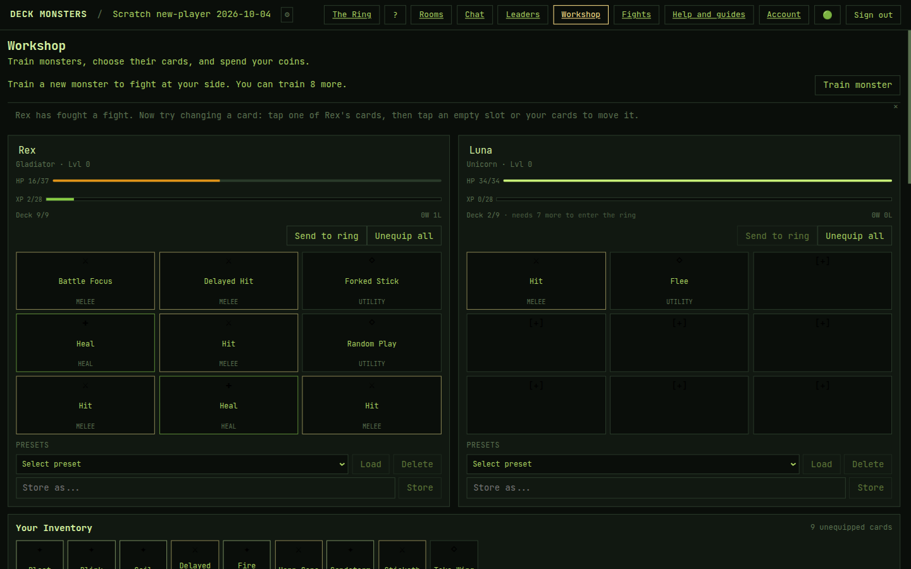

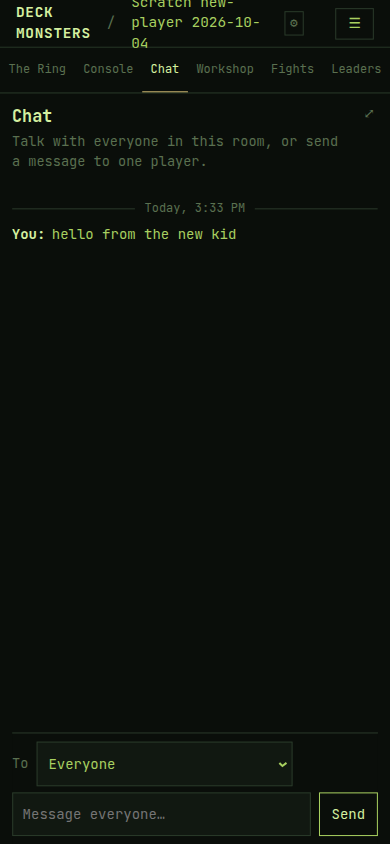

## 4. Questions a new player would ask that nothing in the game answers

- What are ac, hp, dex, str, and int, and why is Class Fighter when the type is Gladiator?
- What do the marks on cards (the dot, the circle, the diamond) mean?
- Which cards can this type equip? `that kind of monster can't use it` does not list them.
- Who is calling bosses in, why does the header still count down, and what does a summon spend?
- `It's Ada's turn` — what am I supposed to do?
- Revive brought Rex back at 1 HP. When is he fightable again, and why did the bar climb with no message?
- The fight paid 2 XP and 10 coins. Where is that said?
- What is MSRP, DPT, and hit chance on a card in the ring?
- What does `Card: Soften` on the Fights row mean?
- What does joining Gryffindor change?

## 5. Docs that are wrong

Checked against How to play, Cards, Items, and the command list in Help, plus the
guide chips.

- The Console guide `Nobody else here? Summon a boss.` was still up after the fight
  had begun and a boss was already standing. The Ring and the line `The fight has begun!` contradicted it.
- Cards says item rules are in `ITEMS.md`. The player-facing item rules are the
  Items tab on that same screen.
- Cards lists `1993-09-7202 18:58` as a card name (`Buy a questionable round of milkshakes for everyone.`).
- The guide `tap an empty slot to add cards` does not match the control. The
  control's own hint is `Tap destination slot or inventory drop zone.`
- The shop's confirm control says `Equip cards` for an item purchase.
- `look at items` produced no list and no empty-state sentence after the hat was
  gone. Help describes that command as `View your items`.

How to play's `a fight starts every 60 seconds` matched the `fight in 59s`
countdown. It does not say the fight itself is longer. That is a gap, not a
contradiction. `Above level 0, a revival takes a few minutes` matched an instant
revive at beginner. It does not say the monster returns at 1 HP.

## 6. Not reached

- A second player. `dm` to Ada was refused as `That's you.` There was nobody else
  to message.
- A revive that takes minutes. Rex was beginner, so it was instant. The wait above
  level 0 was not seen.
- Giving an item to a monster. The only item in reach was the free hat, and using
  it consumed it. Everything else in the shop was 33 coins, and Ada had 10.
- The Fights play-by-play. The list row did not open when the title was tapped.
- Luna never got a full deck, and she never entered the ring. The guide asked for
  it after the fight, and the walk stopped at the first fight.
- The whole training conversation was not repeated at 1440. Desktop was the Ring,
  the Workshop with both monsters, Leaders, and Chat.
