# Live check of the walk fixes

Checked on 2026-10-04 at <https://deck-monsters.com>, on branch `cursor/walk-fixes-check-43a`, from `main` at `d3e8c789`. The checklist is [43a](../archive/roadmap/43a-cursor-walk-fixes-check.md).

The room was `Scratch walk-fixes check 2026-10-04 long room` (45 characters), created for this check and deleted at the end. The character is Ada (they/them). The monsters are Rex, a Gladiator, and Luna, a Unicorn. Phone shots are 390×844. Desktop shots are 1440×900. Native `title` tooltips do not paint into screenshots; where a tooltip is the judgement, the `title` attribute was read from the element.

## A. Start and the Workshop

| Item | Result | What was on screen |
|---|---|---|
| 1. 30 coins | Pass | Ada's card reads `Coins: 30`. The shop opens with `You push open a hidden door and find yourself in The Mad Elemental with 30 coins in your pocket.` |
| 2. Two monsters, stacked and side by side | Pass | At 390 the Workshop panels stack (both start at the same left edge). The row's scroll width equals its width, the page scroll width stays 390, and there are no pager dots. Each panel is taller than the phone screen, so Luna is below Rex once you scroll. At 1440 the two panels sit side by side. |
| 3. First-deck note | Pass | `Give Rex a full deck: tap a card in Your cards, then tap one of Rex's empty slots. Fill all 9.` Tapping a card in that list, then an empty slot, filled all 9. |
| 4. Moved 2 cards / Moved 1 card | Pass | `Moved 2 cards to Luna.` then `Moved 1 card to Luna.` A later move read `Moved 1 card from Luna to Rex.` The screen never said `1 cards`. |
| 5. Long room name | Pass | At 390 the header is one line: `DECK MONSTERS / Scratch w…` with the gear on that same line. |
| 6. Leaders swipe | Pass | The table's right edge fades. A touch swipe inside the table reached `Win %`. The page scroll width stayed 390. A mouse drag on the same table left it unmoved; the wheel and a real touch both scrolled it. |

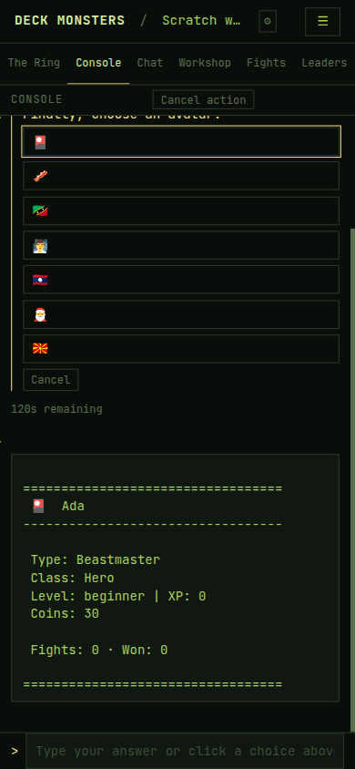

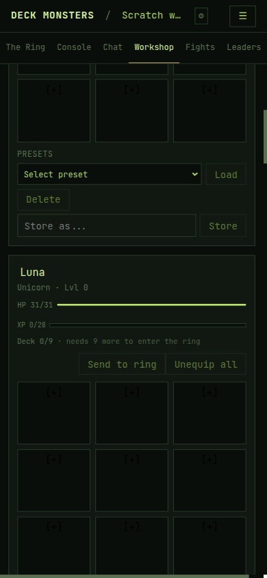

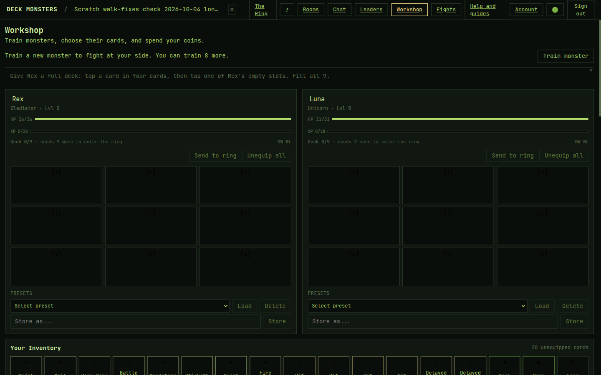

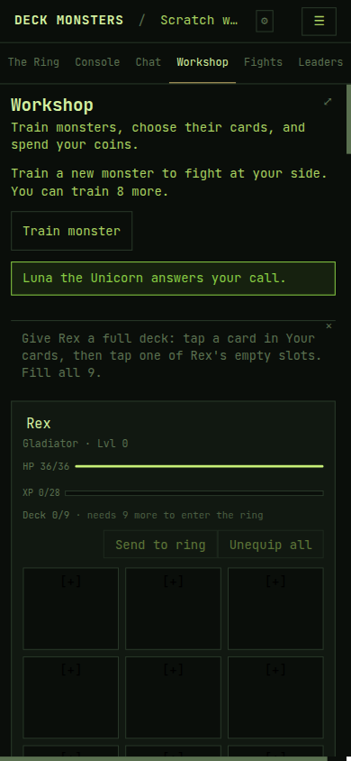

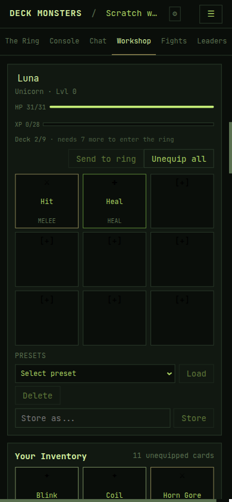

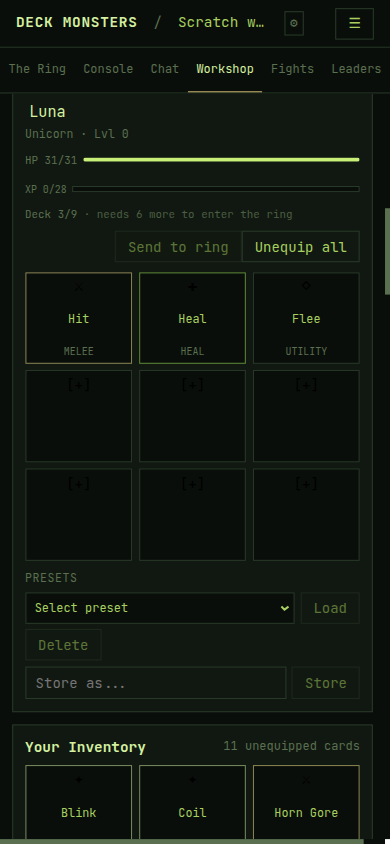

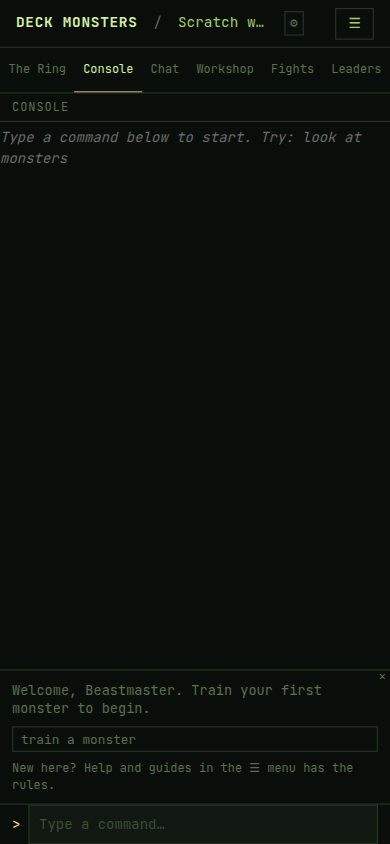

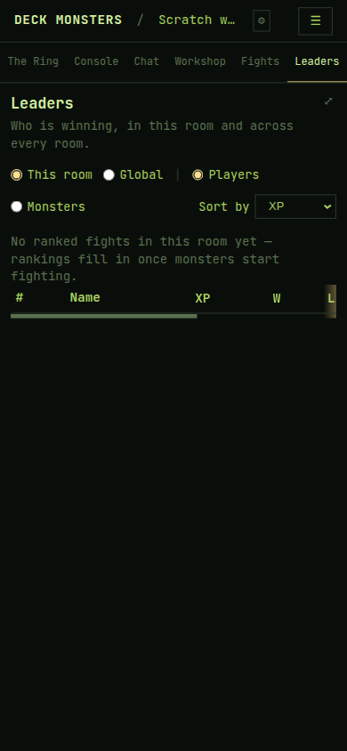

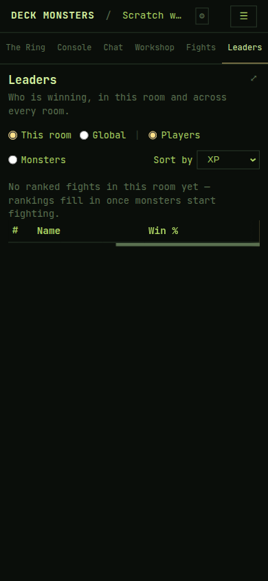

## B. The fight

| Item | Result | What was on screen |
|---|---|---|
| 7. Guide once a boss is in, and during the fight | Fail | Once Iffehi was in, the guide read `Rex is in the ring. Watch The Ring: a fight starts when the countdown ends.` The summon chip was gone. During the next fight, after `The fight has begun!`, the guide was still `Rex has fought a fight. Now try changing a card. Type help unequip to see how, or use the Workshop.` with the chip `help unequip`. That was still true more than 15 seconds after the fight started. `Rex is fighting. Watch The Ring.` never appeared. |
| 8. No `boss in ~…` while a boss stands | Pass | With Cuda standing, the ring header read `fight in 58s` and `1 summon left`. It did not read `boss in ~…`. At 1440 the summons badge's `title` is `Bosses you summon. The house also sends one on its own timer, which doesn't use yours.` |
| 9. House arrival, orders, no boss record | Pass | `A braggardly Gladiator enters the ring, sent by the house (👑 The Editor).` and later `A swaggering Jinn enters the ring, sent by the house (👑 The Editor).` The boss card says `Iffehi's orders:` / `Cuda's orders:` and has no `Fights: … · Won: …` line. Rex's card in that same feed reads `Fights: 1 · Won: 0`. |
| 10. Turn line | Pass | `It's Ada's turn. Rex plays the next card in their deck.` Iffehi's turn used the same shape: `It's Iffehi's turn. Iffehi plays the next card in her deck.` |
| 11. Revive | Pass | `Rex has begun to revive. They are a beginner monster, so they come back right away, with 1 HP. Monsters heal a little at a time while they rest.` |
| 12. Fights row and play-by-play | Pass | The row reads `Iffehi won vs Rex in 1 round · Card found: Pick Pocket`. Tapping it showed `Loading the play-by-play…` and then `Events during this fight`. The loading line was on screen for a fraction of a second, so the still below is the event list. The second fight's row was the same shape, `Card found: Dissonant Voice`. |

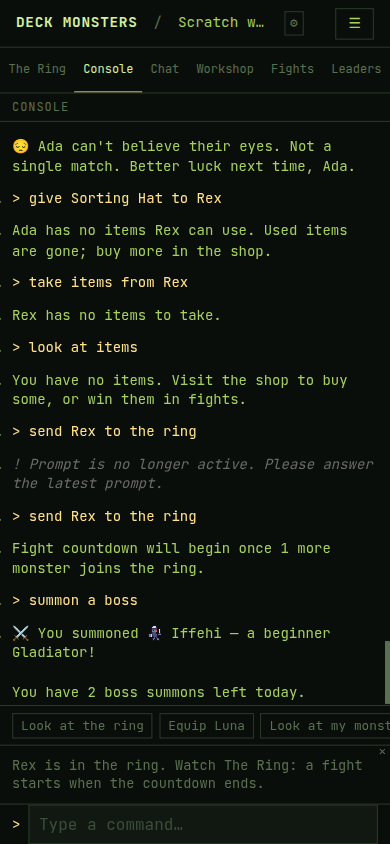

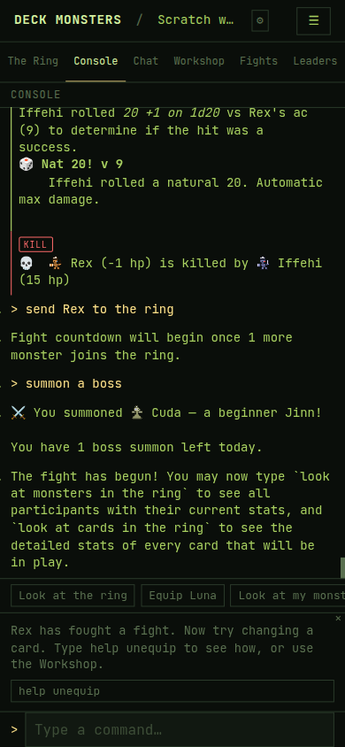

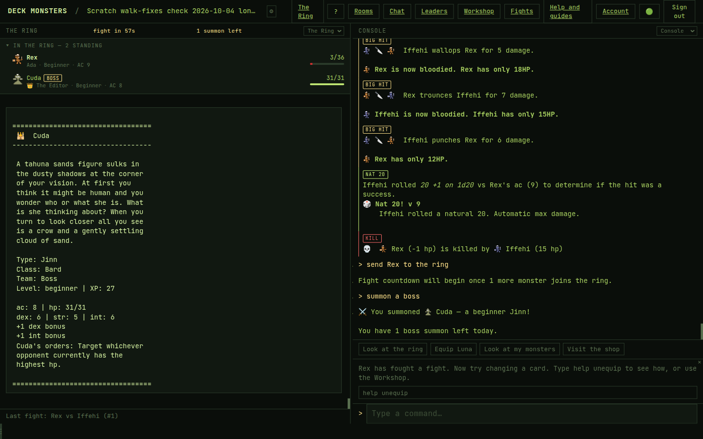

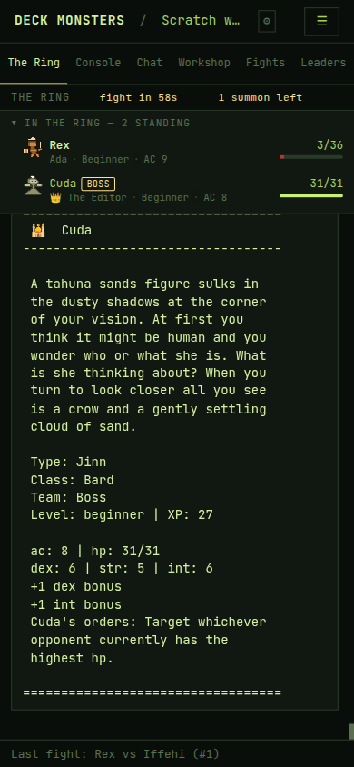

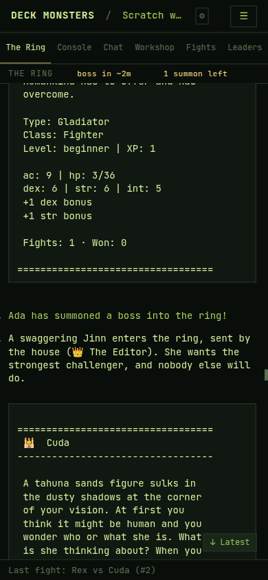

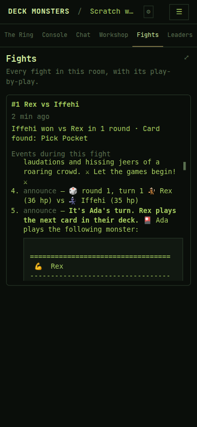

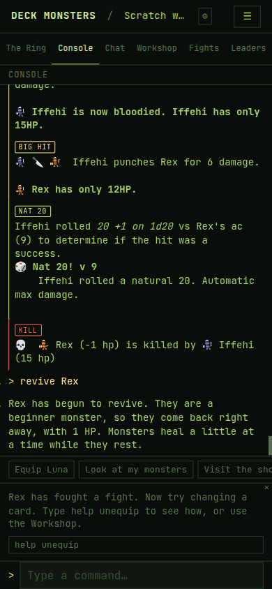

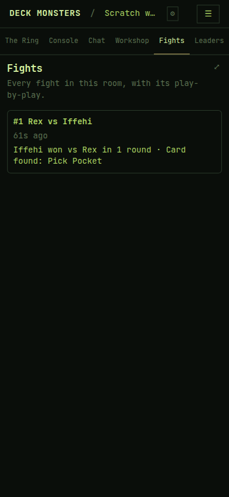

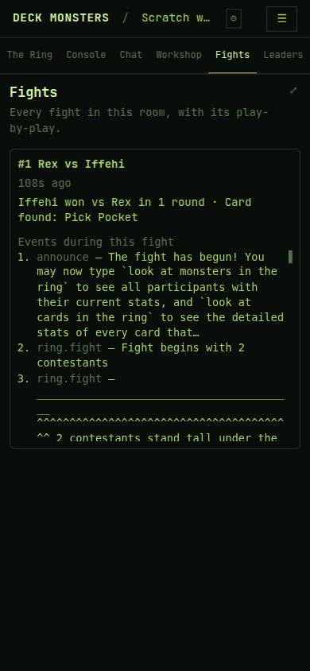

## C. The shop and items

| Item | Result | What was on screen |
|---|---|---|
| 13. Buy button, confirm, receipt | Pass | The button read `Buy items` while nothing was picked, then `Buy 1 item`, then `Buy 2 items`. Confirm: `Sorting Hat and Lottery Ticket from The Mad Elemental for 17 coins. Buy them? (yes/no)`. Receipt: `Sold: Sorting Hat and Lottery Ticket. Ada has 13 coins left. Use an item with use, or give it to a monster with give.` |
| 14. Sorting Hat | Pass | `Put on the Sorting Hat? You choose a new team for Ada, and the hat is used up. (yes/no)` |
| 15. No items left | Pass | `You have no items. Visit the shop to buy some, or win them in fights.` `give Sorting Hat to Rex` answered `Ada has no items Rex can use. Used items are gone; buy more in the shop.` `take items from Rex` answered `Rex has no items to take.` |

The `{Item ×2 and …}` confirm was not on screen. See Not reached.

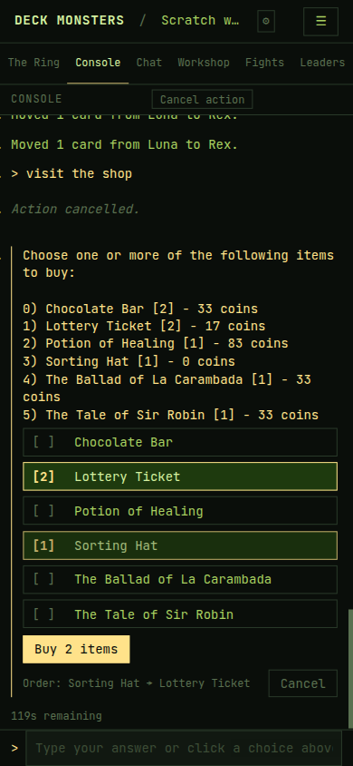

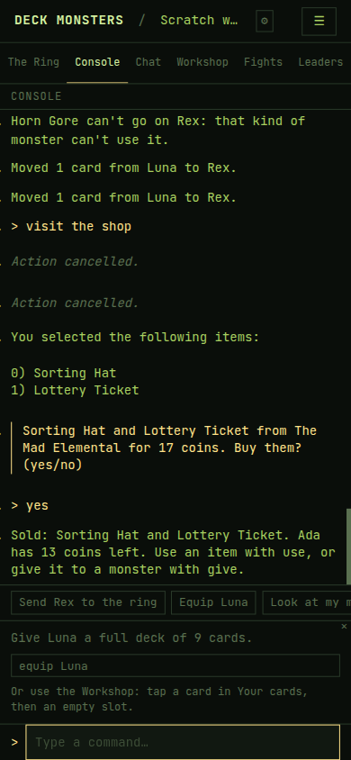

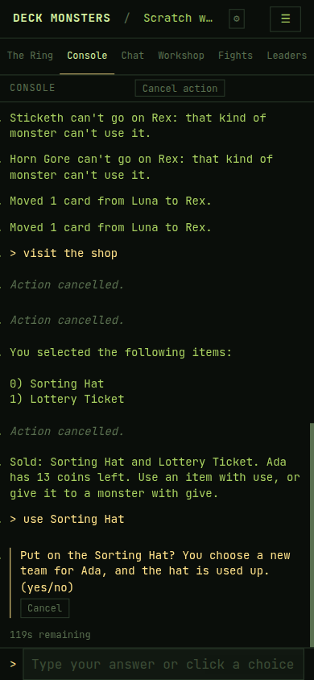

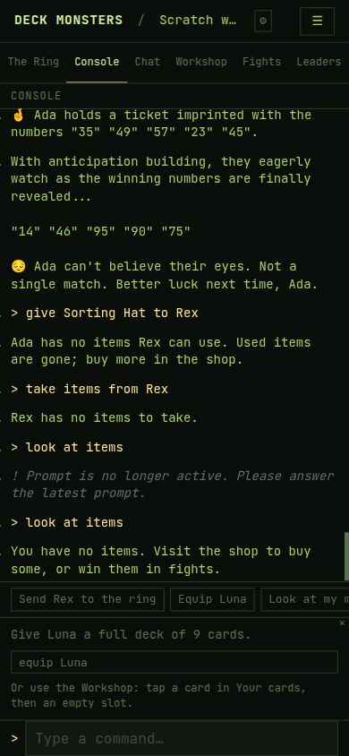

## D. Questions that are over

| Item | Result | What was on screen |
|---|---|---|
| 16. Equip left open for 2 minutes | Pass | The card buttons disappeared. The lines were `This action timed out. Try the command again.` and `The game stopped waiting for your answer. Try the command again.` The next line, `help`, printed the help text the first time. |
| 17. Reload, then wait out the server | Pass | Reload put the same equip question back, with `119s remaining`. After the wait, the same two timeout lines replaced the buttons. `help` printed the help text. `Prompt is no longer active` did not appear for that line. |
| 18. Two questions | Pass | Answering `Basilisk` left those type buttons disabled and opened `Which pronouns should we use for your monster?` with live `he/him`, `she/her`, and `they/them` buttons. Clicking a disabled type button did not change the question. |
| 19. Offline answer | Pass | With the pronoun question open, the network was turned off and `they/them` was clicked. The button stayed highlighted, the box placeholder became `Type a command…`, and the console showed `Action cancelled.` When the network came back, that click had counted: the pronoun buttons were disabled, and the live question was `What would you like to name them?` with a fresh countdown. |

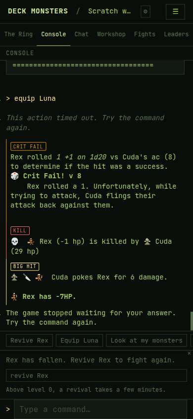

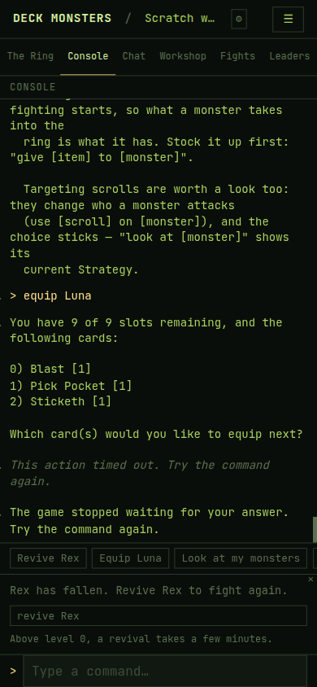

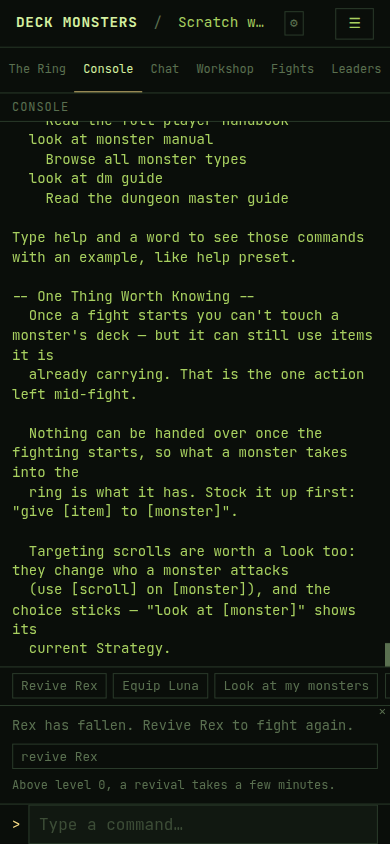

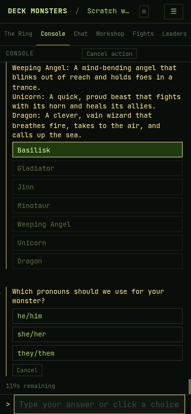

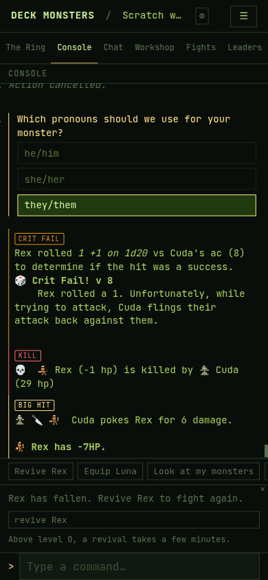

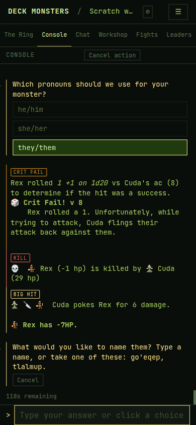

## Not reached

- **Item 13, two copies of one item.** A click on a shop line toggles it. It does not add a second copy, so the confirm never took the shape `{Item ×2 and …}`. Two Lottery Tickets would have been 34 coins, and Ada had 30, so that pair was unaffordable as well. The confirm that did show, for one Sorting Hat and one Lottery Ticket, is quoted under item 13.

## Anything else confusing

- **The guide stops watching the ring after the first fight.** Item 7. The waiting sentence is right for the first boss. After that fight the guide moves on to changing a card, and a second fight leaves it there, summon chip gone, with `The fight has begun!` already in the console. [07-during.png](walk-fixes-check/07-during.png)
- **`Look at my monsters` is the chip, and the game refuses it.** The chip label is `Look at my monsters`. Typing that answers `I don't see a my monsters here.` `look at monsters` shows the monsters.
- **A finished prompt still eats the next line after a reload.** Several times, the first command after a reload was answered with `Prompt is no longer active. Please answer the latest prompt.` The same line sent again, without reloading, ran. Items 16 and 17, typed only after the timeout lines were on screen, did not do this. The empty-items shot shows one eaten `look at items` and the retry that worked. [15-empty.png](walk-fixes-check/15-empty.png)
- **The Workshop list is titled `Your Inventory`.** The first-deck note says `Your cards`. The gesture in the note works. [03-note.png](walk-fixes-check/03-note.png)
- **The shop confirm sits under `Action cancelled.`** Twice, before `Sorting Hat and Lottery Ticket from The Mad Elemental for 17 coins. Buy them? (yes/no)`. Answering `yes` still bought them. [13-receipt.png](walk-fixes-check/13-receipt.png)
