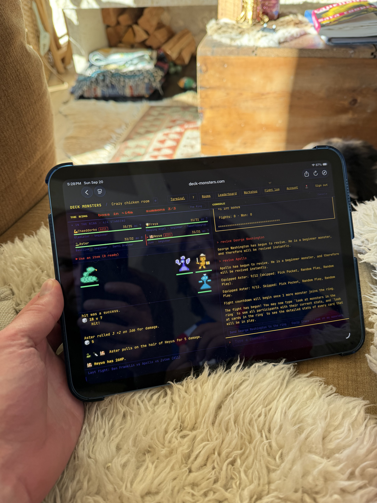
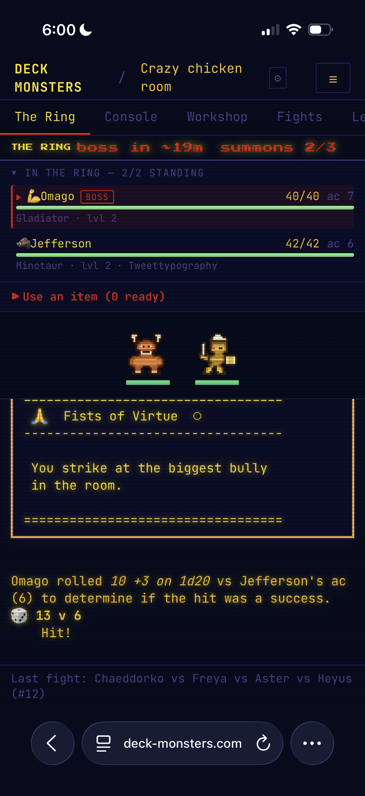
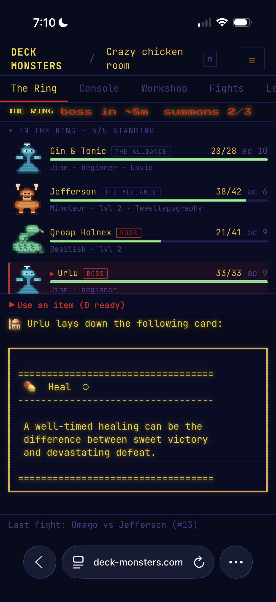

# 23 — Pixel Fight Animations: From a Band to the Roster

**Category**: Product / UI
**Status**: Shipped (#167). The animations live in the Ring roster rows. Superseded in
part by [24 — Pixel Monsters Everywhere](24-pixel-monsters-everywhere.md), which made them
the default on every theme with an opt-out. Remaining questions are at the end.

The pixel-art fight animations were built as a canvas band above the Ring feed. They
worked, were reachable, and were readable — and were still wrong, because they re-drew
state the roster already showed and spent viewport doing it. This doc records the evidence,
the decision, and what is left.

## How we got here

| Ref | What changed |
|---|---|
| [archived plan 17](../archive/roadmap/17-pixel-art-fight-animations.md) | Original build: theme-gated canvas layer over the Ring feed |
| [#164](10b-bugs-fixed.md) | Sprites redrawn 16×16 → 24×24; poses shear instead of translating |
| [#165](10b-bugs-fixed.md) | Overlay → docked band; `inEncounter` adoption; compact duel on phones |
| [#166](10b-bugs-fixed.md) | Opt-in setting, off by default — bought time to decide |
| [#167](10b-bugs-fixed.md) | **Band deleted; sprites moved into the roster rows** |
| [#168](10b-bugs-fixed.md) | Sprite gutter squeezed names to `G..` in the two-up layout |
| [#169](10b-bugs-fixed.md) | Row reorganised around field priority; multi-column dropped; sprite 48px → 24px |
| [#169](10b-bugs-fixed.md) | Columns restored as explicit width tiers — two-up at 46rem, three-up at 70rem |
| [#170](10b-bugs-fixed.md) | Turn marker hung in the row padding; icons lead the row — first change here verified in a browser |

## The evidence

Two photos of real sessions, which between them say more than the test suite ever did.

### Tablet, landscape

Four contestants, two bosses. `IN THE RING — 4/4 STANDING` lists each with an HP bar, exact
numbers, level, owner and a `BOSS` tag. Directly beneath, the band drew the *same four* with
the *same HP bars* and none of the labels. One monster sat alone at far left, three clustered
at far right, and the middle two-thirds was dead pixels. The narration — the game — was about
six lines.

### iPhone, portrait

Two contestants. This one is the clincher, for two reasons:

1. **Four HP bars for two monsters in one viewport** — two in the roster, two under the
   sprites. The duplication is not subtle; it is most of what the band contributed.
2. **The roster already answers "whose turn is it"**. Omago's row carries a red left border,
   a tinted background and a `▶` marker — the `acting` flag, rendered since
   [archived plan 18](../archive/roadmap/18-live-ring-roster.md). The band's main claim to
   usefulness was already being met, better, eight rows up.

## The decision: the left-vs-right metaphor was the root error

Everything above traces to one borrowed assumption. The band was a Street Fighter bout — my
monster left, yours right, facing off. Deck Monsters ring fights are not duels. They are
2–12 contestant melees with bosses, teams and targeting strategies, where a card can hit
anyone. There is no left side and no right side.

Forcing an N-way melee into a two-sided layout produced the dead middle, the lopsided
clustering, and the need for a band tall enough to hold two rows per side. The compact duel
view was the same mistake at a smaller size: it invented a one-on-one that was not happening.

So the band was not tuned. It was deleted.

## What shipped instead

A 48px sprite in each roster row's left gutter, animating that contestant.

- **It costs no vertical space.** A roster row is already about 48px tall — name line, HP
  bar, creature/level line. The sprite sits alongside all three. The band cost 96px on a
  phone and 200px on a tablet; the roster grew by roughly nothing.
- **One monster, one row, one HP bar.** The duplication is gone rather than rearranged.
- **It scales to twelve.** A long roster is a long list, not an impossible stage.
- **It pairs with the highlight that already existed.** The acting row tints and the sprite
  in it lunges. Two cues, one place to look.
- **The scene model got much smaller.** No sides, no per-side cap, no `active` flag, no fade
  timer, no `inEncounter` adoption — the roster is the authoritative list, so a monster with
  no recorded pose simply idles. `state.ts` went from a scene to a map of transient poses.

`faint` is deliberately *not* stored in that map: the roster's `dead` flag is authoritative
and outlives any animation, so a revived monster cannot keep a stale fallen pose.

## After it shipped

Five contestants, sprites in the gutter, full names, team tags, HP bars and the acting
highlight — all in less vertical space than the old band alone used to take.

One regression came out of it (#168): the sprite gutter was not budgeted into
`.roster-list`'s two-up column minimum, and together with an already-rigid team tag it
collapsed monster names to `G..` on a tablet. Fixed by giving sprite-bearing rows a wider
column minimum and letting the team tag ellipse instead of the name.

## The design round (#169)

Five row layouts were rendered at real widths and reviewed against real play. The winner
is a density-switching row — comfortable up to eight contestants, one line above that —
and the reasoning, the field priority it encodes, and the four rejected alternatives are
in
[`docs/architecture/ring-roster-and-pixel-monsters.md`](../architecture/ring-roster-and-pixel-monsters.md).

Two things from that round are worth repeating here because they reverse earlier decisions
in this very doc:

- **The 48px sprite was wrong.** This plan argued a 48px icon was free because it matched
  a roster row's height. It did fit, but the small 24px silhouette reads better and lands
  in the box the emoji already had, making the emoji a genuine fallback. Sprites are now
  24px.
- **Grouping by team is forbidden, not merely unhelpful.** The roster's row order is the
  order of play (`Ring.doAction` shifts off `this.contestants`). Any future idea that
  sorts or groups this list destroys information nothing else on screen carries.
- **Dropping columns entirely was an overcorrection.** #168 was blamed on multi-column
  layout and the list was pinned to one column. The real fault was the 13rem
  `minmax()` *minimum*: it let a column be narrower than a row's text needs, which is what
  produced `G..`. Columns are now earned at explicit container widths — two at 46rem,
  three at 70rem, with no `auto-fit` — so a wide desktop window fills instead of running a
  single 100rem-wide column of 24px sprites. Phones and both tablet orientations stay
  one-up, which is the case every screenshot in this doc shows. The columns flow row-major
  so the rule above still holds: reading order is still the order of play.

## Remaining questions

- **Is the 24px sprite's motion worth having?** At 1× the attack lean is a twitch. It works
  as an ambient "whose turn" tell; if it proves too busy across twelve rows, the next lever
  is animating *only* the acting contestant and leaving the rest on a static frame.
- **Should the setting be per-room rather than per-device?** It is in `localStorage`, so it
  does not follow a player from phone to tablet. Cheap, and possibly not right.
- **Where should the setting live?** Account, next to the key-timestamps toggle. A "Ring
  display" group would be better once there are three of these. (Now an opt-out — roadmap
  24.)
- **Is eight the right density threshold?** It is the largest count that fits the 40% cap
  comfortably on a phone. Keying off pane height instead would be steadier but harder to
  predict, and the roster would change shape on rotation.
- ~~**`useRingKeyTimestamps` has a latent staleness bug**~~ — fixed in roadmap 24 (#171): it
  and `usePixelMonsters` now share one `createStoredFlag` store.

## Process note

Every real defect here was found by looking at the thing, never by a test: six identical
blobs, a serpent that read as a duck in the browser after reading as a snake in ASCII, a
stage a phone user could never trigger, and finally a band duplicating the roster — that
last one only visible in a photo of a real device, after it had shipped and passed CI twice.

The tests were not wrong; they were answering "is the map well formed" while the question
was "does this help someone playing the game". Keep rendering it and looking at it. See
"Common Pitfalls" in [`docs/reference/pixel-art.md`](../reference/pixel-art.md).
