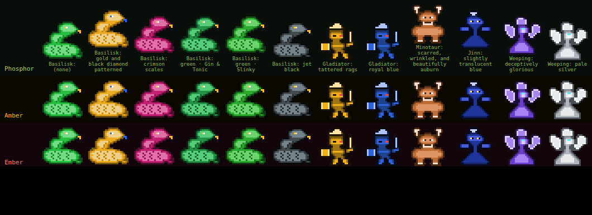
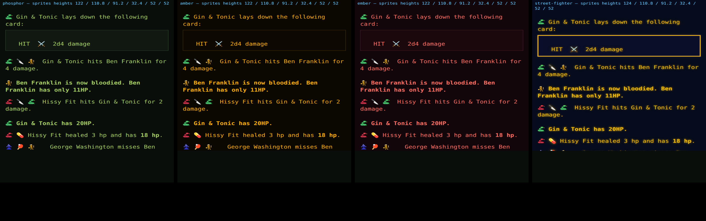

# 24 — Pixel Monsters Everywhere

**Category**: Product / UI
**Status**: In progress
**Branch**: `claude/improve-pixel-art-theme-gg6869`

After #170 the roster sprites were judged ready to graduate: "This actually looks great and
I'm thinking it's maybe time to a) make this the default with the setting becoming an
opt-out b) expand it to all themes c) potentially add some color variations so that, for
example, if there are multiple basilisks in the ring they don't all have the same color and
finally d) maybe even use these items every time the character is referenced (in battle
feed etc) on the web as long as we can do so without disrupting text layout rather than
using the existing emoji representations."

## Tasks

| # | Task | Status | Commit |
|---|---|---|---|
| T1 | Sprites on by default, the setting becomes an opt-out; every theme, not only SNES | Done | `b1d85f0` |
| T2 | Engine publishes each contestant's `appearance` in `ring.state` | Done | `92f44d4` |
| T3 | Sprite palette derived from the monster's appearance text | Done | `7af0b0b`, review fix `25c44fe` |
| T4 | Sprites inline wherever narration names a known monster: Ring feed, Console, fight history | Done | _this commit_ |
| T5 | Browser verification sheet (themes × variations × feed at 2×/3×), docs folded back | Pending | — |

## Decisions

### Full colour on every theme, no per-theme tinting

The monochrome themes (Phosphor, Amber, Ember) already show full-colour emoji in the roster
and throughout the feed — `🐍`, `💪` and the rest ignore the theme entirely. A full-colour
sprite in the emoji's own box is therefore consistent with what those themes already look
like, not a break from it. Tinting sprites to the theme's foreground was considered and
rejected: it would erase exactly the colour variation T3 exists to add.

### Colour comes from the monster's appearance, not a random hue

Every monster already has a colour. The workshop's spawn form asks for **Appearance**
(required, free text — "gold and black", "slightly translucent blue"), the Discord and text
flows ask the same question, and bosses get a random colour name from `grab-color-names`.
It is stored as `options.color` and until now only fed the monster's prose description.

Driving the palette from it means a basilisk described as emerald actually renders green —
the variation *means* something, and a player controls it. The mapping takes the first
recognised colour word in the text; text with no colour word in it ("deceptively
glorious") falls back to the species' own palette. A small per-monster shift derived from
its name separates two monsters whose owners both wrote "green", so two basilisks in one
ring are never pixel-identical — the literal ask in (c).

### How the recolour works, and what rendering it changed

`animations/pixel-fight/appearance-palette.ts`. The first colour word in the appearance
text sets the hue and saturation; the species palette's hand-spaced **lightness** ramp
(outline → shadow → body → lit → highlight) is kept, so a recoloured sprite still reads as
shading (#164). A lightness word shades only the colour right after it ("dark blue", not
"dark and stormy blue"). The eye swings to the opposite hue when the body would swallow it
(an amber-eyed basilisk described as gold). A "black" monster keeps its body above 26%
lightness so it survives every theme's near-black background.



Two things only the render caught:

- **Same-colour monsters were indistinguishable.** The first per-name nudge was ±12° of
  hue; five basilisks all described as "green" came out as one green at 24px. It is now
  ±20° of hue and ±9 points of lightness — enough to tell five apart, still all green.
- **Hue is not perceived evenly.** That wider spread turned a "gold and black" basilisk
  orange: between orange and yellow a few degrees is a different colour. In that band the
  name now moves the hue by at most 6° and leans on lightness instead. Gold and yellow
  also needed a lightness lift — on a basilisk's mid-dark body they read brown and olive.

The contact-sheet page used for this is kept as
`assets/pixel-monsters-2026-09/contact-sheet.entry.ts.txt` (bundle it with the repo's
esbuild and open it in headless Chromium).

Collisions are still possible: two monsters of one species, both "green", whose names
happen to hash close. A ring-aware de-duplication was rejected because a monster's colour
would then depend on who else is in the ring — it could change mid-fight, and differ between
the roster and the feed.

### The opt-out keeps its storage key

The flag was `deck-monsters-pixel-fight-stage = '1'` for on, absent for off. Flipping the
default means absent must now mean *on*, so off is stored explicitly as `'0'`. Players who
opted in keep `'1'` and stay on; players who never touched it get the new default; nobody
who had chosen off exists yet in a way that matters, because off *was* the absent default —
there is no stored "I turned this off" to honour.

### Feed sprites: matched, never guessed

The feed is flat engine text shared with Discord, so the engine cannot emit web-only markup
saying which emoji is which monster. The web matches instead
(`utils/monster-mentions.ts`), against every monster the room's Ring has shown this
session (`hooks/useKnownMonsters.ts` — accumulated so a finished fight's lines keep their
sprites, and keyed by room per `docs/room-scoping.md`). Anything unmatched keeps
its emoji: the failure mode is "looks like today", never "wrong monster".

The plan's first idea — match `icon + ' ' + name` — would have missed the most common line
in a fight. Surveying every engine template that places a monster icon found the hit line
is `🐍 🔪 💪  Gin hits Ben` (attacker, damage, target icons *then* both names), the HP line
is `🐍 *Gin has…` and a level-up is `🐍  **Gin**`. Two rules cover every template:

1. **Icon before its own name**, allowing whitespace, `*`/`_` markup and one other emoji
   (the heal line's 💊) in between.
2. **The hit/miss cluster**: three single-spaced emoji then two or more spaces. The first
   and third map to the first and second monster named after them (the first twice for a
   monster that hit itself); the middle damage emoji is never touched. It runs after rule 1
   and overrides it, because in `💪 🔪 💪  Ben hits Max` rule 1 alone pins the third 💪 to
   Ben.

Pairing each icon with a *name* is what keeps two default-🐍 basilisks in one fight apart.
Fenced ``` blocks are never touched: they hold ASCII card art in monospace columns.

Known gap: a player who gives their monster an emoji that is also a flavour emoji (🔥, 🔪)
could have that flavour emoji drawn as their sprite in a line that names them. Rare, and
harmless beyond looking odd; fixing it would need the engine to mark icons, which it cannot
do without changing Discord's text.

### Feed sprite size: 16px, chosen by rendering

The feed is 14px text on a 19.6px line; the art is 24×24 and fills 22–23 rows of it, so
there is nothing to crop. Pixel art is only perfectly crisp at a whole number of device
pixels per art pixel. Three strategies were rendered in Chromium at 1×, 2× and 3×, with
every line's height measured:

| Strategy | 3× (iPhone) | 2× (iPad) | Layout |
|---|---|---|---|
| **16px always** (chosen) | crisp, 2 px per art px | 1.33 — uneven but not visibly so at this size | line heights identical to the emoji |
| Crisp only: 16px at 3×, 12px at 2× | crisp | crisp but smaller than the emoji; hard to read | identical |
| 24px, negative margins | crisp | crisp | changed where lines wrapped; heavier than the text |

At 1× the 16px sprite is a shrink of the art and still reads as its species.



Measured on every theme with and without sprites: line heights 122 / 110.8 / 91.2 / 32.4 /
52 / 52 (124 for the first line on the SNES theme, whose card blocks have a thicker border —
identical with emoji). Nothing wraps differently.

### Every narration surface, from one room-keyed store

The Ring feed, the Console and the fight-history panel all render narration through
`formatEventText`, which takes an optional `MonsterMentions`. Only the Ring pane sees
`ring.state`, so it *records* the room's monsters into a small store
(`hooks/useKnownMonsters.ts`, `rememberMonsters`), and each surface *reads* its own room's
entry through `useMonsterMentions(roomId)`. The store is keyed by room — a reader never sees
another room's monsters (`docs/room-scoping.md`). Fights from before this session name
monsters the store has not seen, so the fight history shows sprites only for monsters that
have been in the Ring since the page loaded; the rest keep their emoji.

### Feed sprites load without Suspense

The roster uses `React.lazy` + `Suspense`. The feed must not: it is virtualised, and a
Suspense boundary would mount it in the fallback and again when the chunk arrived, losing
the reader's scroll position. `useInlineSprites` loads the renderer in an effect and the
visible lines re-render in place when it lands.

Icons are player-editable (`editSelf` offers "Icon/color"), so a monster's feed emoji is not
necessarily its species'. With the feature on, the sprite replaces it everywhere — in the
roster it already does — so a monster has one face. The opt-out restores the emoji.

### Only a monster's own emoji is replaced

`docs/voice-and-wording.md` treats emoji as part of the world's voice. The feed swap
replaces a monster's *identity* emoji — the icon before its name — and nothing else: card,
item, effect and Beastmaster emoji stay. Beastmasters have no sprites.

### The theme-feature mechanism is gone

`THEMES[].features`, `useThemeFeature` and the `data-theme-features` attribute existed only
to gate the sprites to the SNES theme. No stylesheet read the attribute. With the gate gone
they were dead code and were removed in T1; `applyTheme` clears the attribute for anyone
upgrading from a build that set it.

### Feed sprites are static

Up to a few dozen visible lines each naming one or two monsters: animating them would be
exactly the "distracting" that got the first version switched off (#166). The roster keeps
the motion; the feed gets a still portrait.

## Process

- Checkpoint commit per task; this table updated in the same commit.
- Every visual claim checked in headless Chromium before it is called done (the recipe in
  `docs/ring-roster-design.md`, "Rendering it without a device"), at the device pixel
  ratios the game is actually played at: 3× (iPhone) and 2× (iPad).
- Independent read-only review per code task, per `AGENTS.md`.
